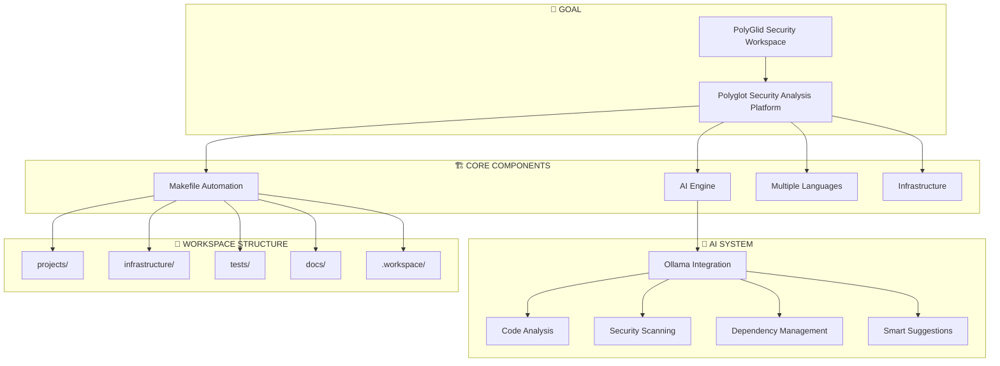
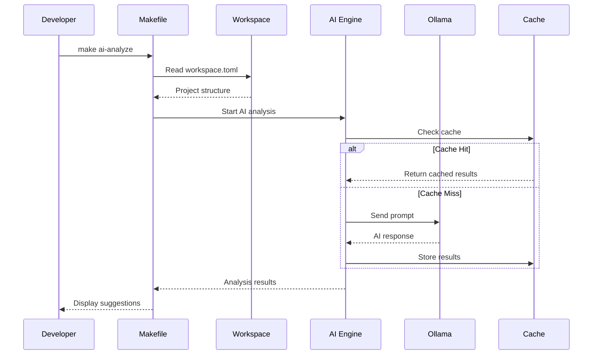
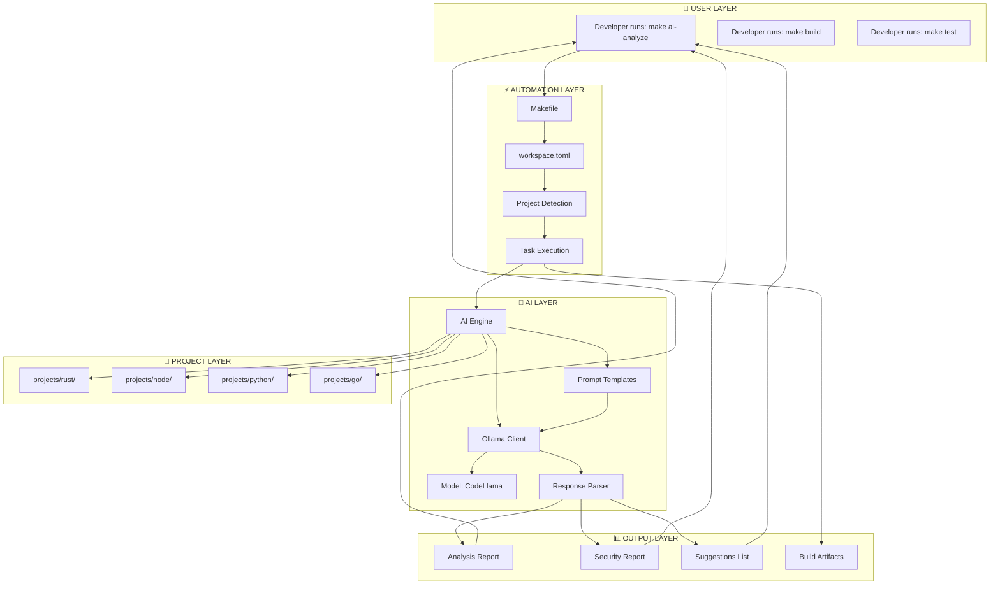
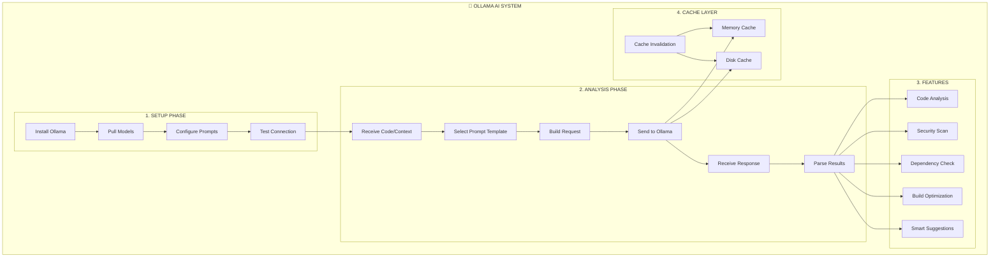
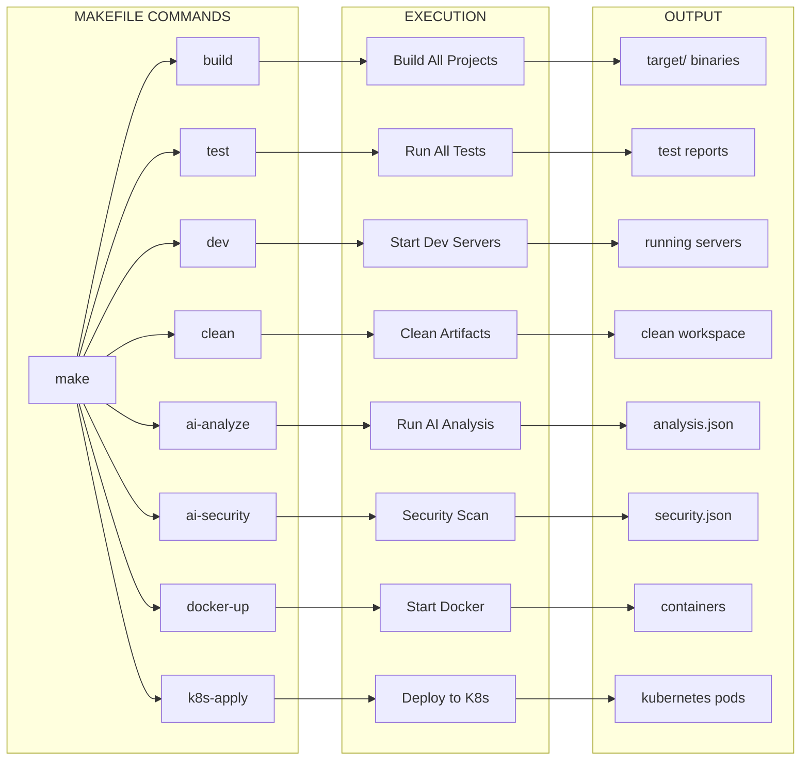
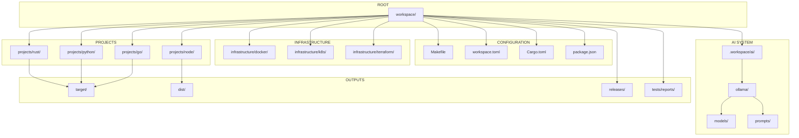
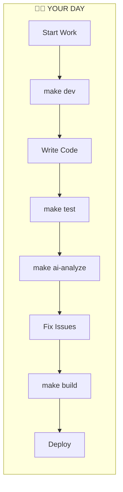
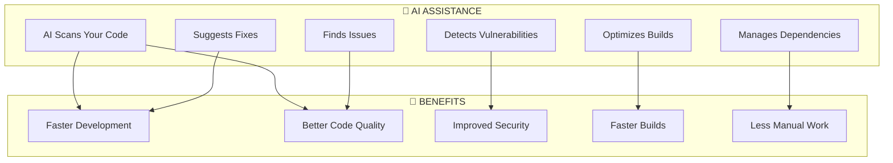
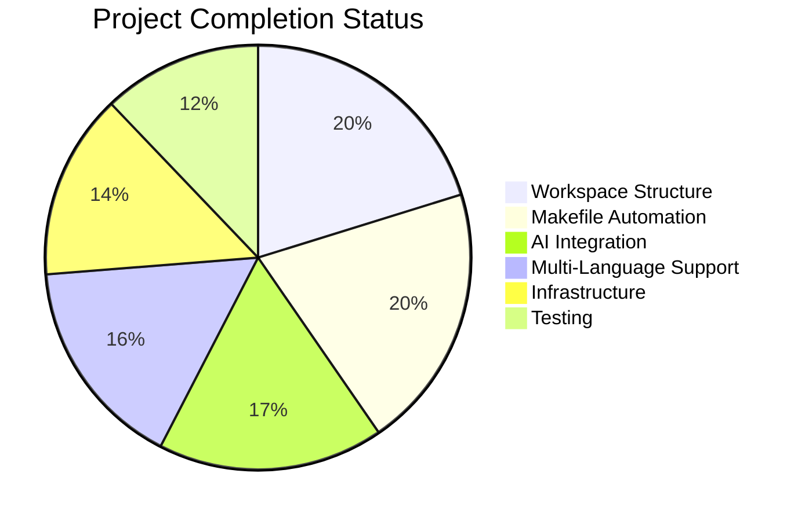
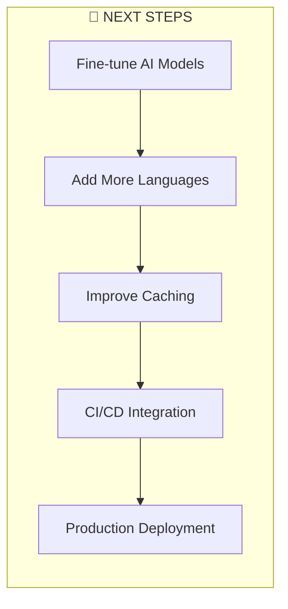

# PolyGlid Security Workspace — Architecture & Flow

## The Big Picture

## User Interaction Flow

## Detailed Component Flow

## AI System Detailed Flow

## Makefile Command Flow

## Workspace Structure Flow

## Developer Workflow

## AI Benefits

## Project Completion Status

## Next Steps

## Quick Reference

| Component | What It Does | Why You Need It |
|-----------|--------------|-----------------|
| **Makefile** | Runs everything | One command for everything |
| **workspace.toml** | Configures workspace | Knows all your projects |
| **Ollama AI** | Analyzes code | Finds issues, suggests fixes |
| **Rust Engine** | Core functionality | Fast, safe, reliable |
| **Infrastructure** | Docker/K8s | Deploy anywhere |
| **Testing** | Ensures quality | Catch bugs early |
