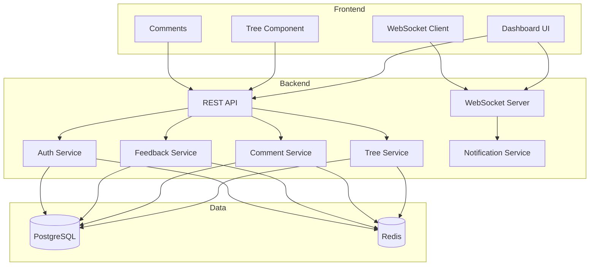

# WPM — Workspace Project Manager

## Overview
A full project management tool integrated into the PolyGlid workspace: dashboard, tree architecture, threaded comments, feedback/rating system, real-time collaboration via WebSocket.

## Feature Set
- **Dashboard** — overview of all projects, tasks, recent activity
- **Tree Architecture** — hierarchical node tree with drag-and-drop reordering
- **Node Comments** — per-node comments with threading and replies
- **Feedback System** — 1-5 star rating + category labels per node
- **Search & Filter** — find tasks, nodes, comments by text/status/assignee

## Project Structure
```
projects/polyglid-desktop/
├── Cargo.toml
├── Dockerfile
├── src/
│   ├── main.rs
│   ├── lib.rs
│   ├── api/
│   │   ├── mod.rs
│   │   ├── auth.rs
│   │   ├── projects.rs
│   │   ├── tasks.rs
│   │   ├── comments.rs
│   │   └── feedback.rs
│   ├── models/
│   │   ├── mod.rs
│   │   ├── project.rs
│   │   ├── task.rs
│   │   ├── node.rs
│   │   ├── comment.rs
│   │   └── feedback.rs
│   ├── services/
│   │   ├── mod.rs
│   │   ├── tree.rs
│   │   ├── comment_service.rs
│   │   └── feedback_service.rs
│   ├── dashboard/
│   │   └── mod.rs
│   ├── db/
│   │   ├── mod.rs
│   │   └── migrations/
│   └── web/
│       ├── mod.rs
│       ├── static/
│       │   ├── js/
│       │   │   ├── tree.js
│       │   │   ├── comments.js
│       │   │   └── drag-drop.js
│       │   └── css/
│       └── templates/
│           ├── dashboard.html
│           ├── tree_view.html
│           └── comment_section.html
└── tests/
    ├── integration/
    └── unit/
configs/wpm/
├── config.toml
└── database.toml
infrastructure/wpm/
├── docker-compose.yml
├── nginx.conf
└── init.sql
```

## Database Schema
- **projects** — id, name, description, root_node_id, status, metadata
- **nodes** — id, project_id, parent_id, name, type (task/milestone/component/module/file), status, priority, assignee, due_date, path (ltree), order_index
- **comments** — id, node_id, user_id, parent_comment_id, content, attachments, is_edited, status
- **feedback** — id, node_id, user_id, rating (1-5), comment, category (bug/improvement/question/praise), is_resolved (unique per user per node)
- **users** — id, username, email, password_hash, full_name, role, preferences, is_active

## API Endpoints

### Projects
```
GET    /api/v1/projects
POST   /api/v1/projects
GET    /api/v1/projects/:id
PUT    /api/v1/projects/:id
DELETE /api/v1/projects/:id
GET    /api/v1/projects/:id/tree
GET    /api/v1/projects/:id/stats
```

### Nodes
```
GET    /api/v1/nodes
POST   /api/v1/nodes
GET    /api/v1/nodes/:id
PUT    /api/v1/nodes/:id
DELETE /api/v1/nodes/:id
POST   /api/v1/nodes/:id/move
GET    /api/v1/nodes/:id/children
GET    /api/v1/nodes/:id/path
```

### Comments
```
GET    /api/v1/nodes/:node_id/comments
POST   /api/v1/nodes/:node_id/comments
PUT    /api/v1/comments/:id
DELETE /api/v1/comments/:id
POST   /api/v1/comments/:id/reply
GET    /api/v1/comments/:id/thread
```

### Feedback
```
GET    /api/v1/nodes/:node_id/feedback
POST   /api/v1/nodes/:node_id/feedback
PUT    /api/v1/feedback/:id
DELETE /api/v1/feedback/:id
GET    /api/v1/nodes/:node_id/feedback/stats
```

## WebSocket Events
```
ws://api/v1/ws
Events: node_created, node_updated, node_deleted, comment_added,
        comment_updated, feedback_added, feedback_updated
```

## Implementation Phases

### Phase 1: Backend Foundation
- Rust project scaffold (Cargo.toml, main.rs, lib.rs)
- config loading, DB init, migrations
- Axum server setup with routes
- Models and DB schema (sqlx or diesel)
- All REST API endpoints (projects, nodes, comments, feedback, auth)

### Phase 2: Dashboard Frontend
- HTML templates + CSS (dashboard, tree view, comment section)
- HTMX or vanilla JS for interactivity
- Stats grid, project list, activity feed

### Phase 3: Tree Architecture
- Tree service (build tree from flat nodes, compute paths)
- Drag-and-drop reordering
- Collapse/expand, export
- Real-time tree updates via WebSocket

### Phase 4: Real-time Features
- WebSocket server (tokio broadcast channels)
- Notification service
- Live updates on comments, feedback, tree changes

## Dependencies
- **axum** — HTTP + WebSocket server
- **sqlx** or **diesel** — PostgreSQL
- **tokio** — async runtime
- **serde** / **serde_json** — serialization
- **uuid** — primary keys
- **tower-http** — cors, auth middleware
- **bb8** or **deadpool** — connection pooling
- **redis** / **fred** — caching + pub/sub (optional)

## Architecture


## Quick Start
```bash
git clone <repo> && cd workspace
make init-wpm         # scaffold project
make wpm-db-setup     # create + migrate DB
make wpm-build        # build binary
make wpm-run          # start server on :8080
```

Makefile targets to create:
- `init-wpm` — scaffold project directory, create Cargo.toml, copy templates
- `wpm-build` — build through `projects/polyglid-desktop/Cargo.toml`
- `wpm-run` — run through `projects/polyglid-desktop/Cargo.toml`
- `wpm-db-setup` — create DB + run migrations
- `wpm-test` — run wpm tests
- `wpm-docker-up` — `docker compose -f infrastructure/wpm/docker-compose.yml up`
