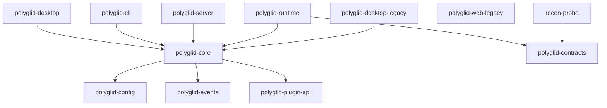

```mermaid
graph TD
  desktop[polyglid-desktop]
  cli[polyglid-cli]
  server[polyglid-server]
  core[polyglid-core]
  runtime[polyglid-runtime]
  config[polyglid-config]
  events[polyglid-events]
  api[polyglid-plugin-api]
  contracts[polyglid-contracts]
  plugin[recon-probe]
  legacy_web[polyglid-web-legacy]
  legacy_desktop[polyglid-desktop-legacy]
  desktop --> core
  cli --> core
  server --> core
  runtime --> core
  runtime --> contracts
  plugin --> contracts
  core --> config
  core --> events
  core --> api
  legacy_desktop --> core

```

## Projects

Auto-generated dependency graph.
