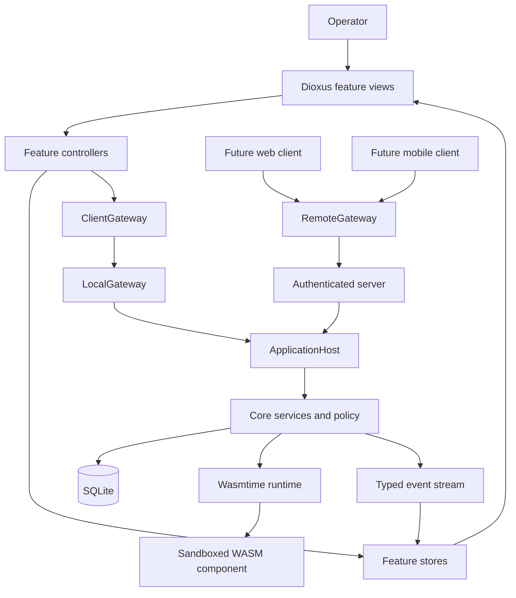
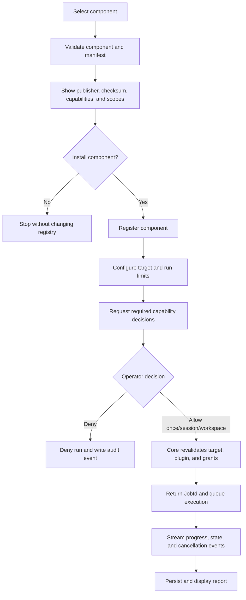

# Client Architecture

This document is the canonical product-client architecture for PolyGlid. The
native Dioxus desktop application is the primary product client. The CLI remains
available as a frozen development and test harness; new product workflows must
be designed for the desktop application first.

The current desktop implementation and its real-versus-preview inventory are
documented in [Desktop UI](DESKTOP_UI.md). The UI-first release boundary is
defined in [MVP](../planning/MVP.md).

## Product Surfaces

| Surface | Role | Current priority |
| --- | --- | --- |
| Dioxus desktop | Complete local workspace, plugin execution, permissions, and reports | Primary |
| Public site | Marketing, documentation, releases, and downloads | Supporting |
| CLI | Regression harness and developer diagnostics | Frozen |
| Web client | Authenticated remote workspace through a server | Future |
| Mobile client | Status, report review, and approvals through a server | Future |

The public `site/` is not the future web application. A web or mobile client
must use a secured, versioned server protocol and must not open a user's local
database or plugin runtime directly.

## Architecture



The required dependency direction is:

```text
view -> feature controller -> ClientGateway -> application/core service
view <- feature store      <- typed result/event <- application/core service
```

Views render state and translate user gestures into feature actions. They do
not read SQLite, instantiate Wasmtime, decide permissions, or call runtime
adapters directly.

## Client Boundary

`ClientGateway` is the single boundary between presentation code and PolyGlid
application behavior. It is a product port, not an HTTP client and not a
Dioxus-specific abstraction.

The local desktop adapter calls an in-process `ApplicationHost`. A future
remote adapter can implement the same client-facing operations over an
authenticated protocol without changing feature views.

### Typed messages

The client boundary uses separate message families:

| Family | Meaning | Examples |
| --- | --- | --- |
| Query | Read a snapshot without changing product state | bootstrap, list projects, plugin details, report history |
| Command | Request a validated state change | create project, record approval, start run, cancel run, change setting |
| Event | Announce an accepted state transition or execution update | project changed, run started, progress, run failed, report ready |
| Error | Explain a safe, actionable failure | validation, permission denied, unavailable, conflict, runtime failure |

Commands and events use stable identifiers such as `WorkspaceId`, `ProjectId`,
`PluginId`, `ApprovalId`, `JobId`, and `ReportId`. A view must not use a display
name or filesystem path as an identity.

Messages should be versionable, serializable data-transfer types. They must not
expose database rows, Wasmtime handles, Dioxus signals, or transport-specific
types. The proposed shared home for those contracts is `crates/client-api`.

The first implementation lives in `apps/desktop/src/client/` and provides
UI-safe DTOs, typed errors, `ClientGateway`, `LocalClient`, and execution
subscriptions. Keeping it beside the only production client is acceptable for
this migration. Move stable contracts to `crates/client-api` before a server or
second client needs them.

### Conceptual gateway operations

```text
bootstrap() -> ClientSnapshot
list_projects(workspace_id) -> ProjectList
inspect_plugin(source) -> PluginInspection
install_plugin(install_command) -> PluginId
record_permission_decision(decision) -> ApprovalId
start_execution(command) -> JobId
cancel_execution(job_id) -> accepted
list_reports(filter) -> ReportSummaryList
get_report(report_id) -> ReportDetails
update_settings(patch) -> SettingsSnapshot
subscribe() -> stream<ClientEvent>
```

`start_execution` returns a job ID after validation and queue acceptance. It
does not block until Wasmtime finishes. Progress, cancellation, failure, and
the final report arrive as typed events.

## Application Host Ownership

One `ApplicationHost` instance is created during desktop startup and shared by
all feature controllers. It owns the long-lived resources required by product
workflows:

- validated configuration and settings services;
- SQLite repositories and migrations;
- workspace and project catalog services;
- plugin registry, validation, and installation services;
- permission policy and approval records;
- execution manager, cancellation handles, and runtime limits;
- report persistence and export services;
- the typed client event publisher.

The host returns a bootstrap snapshot for initial rendering and then publishes
events for changes. A feature should not repeatedly reopen the database or
construct its own runtime.

## Desktop State Ownership

The target UI state is split by behavior rather than by screen position:

| Store | Owns | Does not own |
| --- | --- | --- |
| `ShellStore` | navigation, open tabs, pane visibility and sizes, active overlay | projects, plugins, reports |
| `ProjectsStore` | workspaces, projects, load/mutation states, selected project | shell layout, plugin execution |
| `PluginsStore` | installed plugins, inspection, install review, enable state | permission policy decisions |
| `ExecutionStore` | run draft, target, approval request, active job, progress, cancellation | report history |
| `ReportsStore` | current report, history, filters, export state | runtime handles |
| `SettingsStore` | persisted UI and engine settings, health snapshot | temporary modal state |

Each feature controller is the only writer for its store. Components receive a
small view model plus explicit callbacks. Cross-feature transitions are
coordinated with typed actions or events instead of reaching into unrelated
signals.

Every asynchronous store uses explicit states:

```text
idle -> loading -> ready
               -> empty
               -> error(actionable message)

idle -> submitting -> accepted -> running -> cancelling -> cancelled
                                      |              |
                                      +-> completed  +-> failed
                                      +-> failed
```

These states prevent a loading indicator, an empty state, and stale data from
appearing at the same time.

## Permission and Execution Flow

Plugin installation and plugin execution are separate security decisions.
Installing or enabling a plugin never means that every requested capability is
approved.



The approval view must show, for every requested capability:

- a plain-language description of the access;
- the exact resource scope, such as a host or workspace path;
- why the plugin requests it;
- whether the decision applies once, for the session, or to the workspace;
- the plugin identity, version, publisher identity, and component checksum.

The core is the final authority. It revalidates approvals immediately before
linking host capabilities and records allowed, denied, expired, and failed
decisions in the audit log.

Component trust is a separate gate before permission review. An official
component must satisfy the same Balanced signature policy as any other plugin;
being bundled or first-party is not an implicit trust grant. Release automation
must sign and verify the exact component and package its adjacent signature.
The client must never silently switch to Development policy for an unsigned
component.

### Current migration position

The desktop local-client boundary now re-inspects the installed component,
requires an explicit per-run selection matching all requested capability kinds,
rejects missing or unexpected approvals, and audits the allow-once decision.
This closes the earlier path that copied every registered capability into the
execution configuration without a separate review.

The current allow-once step is the first security slice, not the final approval
model. Approval IDs, manifest resource scopes, expiration, session/workspace
decisions, and a persisted decision-management view still belong in core before
the desktop MVP satisfies the complete flow above.

## Primary Desktop Journey

The first complete product journey is deliberately small:

```text
open desktop
  -> select or create project
  -> inspect or select plugin
  -> configure an authorized target
  -> review and decide requested capabilities
  -> start run and receive a JobId
  -> observe progress or cancel
  -> inspect the persisted report
  -> export the report
```

The primary navigation for that journey is Projects, Scan, Executions, Reports,
Plugins, and Settings. Work Tracks, Automation, AI Agents, an interactive
terminal, and fabricated metrics have been removed from the desktop production
source. Do not reintroduce them until they have real application services and a
defined place in the product journey.

## Target Desktop Layout

The current modules are retained while responsibilities move behind feature
boundaries:

```text
apps/desktop/src/
├── app/
│   ├── bootstrap.rs
│   └── host.rs
├── shell/
│   ├── layout.rs
│   ├── navigation.rs
│   └── overlays.rs
├── features/
│   ├── projects/
│   │   ├── controller.rs
│   │   ├── store.rs
│   │   └── view.rs
│   ├── plugins/
│   ├── scanner/
│   ├── executions/
│   ├── reports/
│   └── settings/
├── client/
│   └── local_gateway.rs
└── shared/
│   ├── components.rs
│   └── presentation.rs

crates/client-api/
├── commands.rs
├── queries.rs
├── events.rs
├── models.rs
└── errors.rs
```

This is a migration target, not a claim that these paths already exist. The
current code map is maintained in [Desktop UI](DESKTOP_UI.md).

## Error and Event Rules

- User-facing failures have a stable category, a safe message, and a suggested
  recovery action.
- Internal error chains go to structured logs; views do not render raw debug
  output or secrets.
- Events are facts written in the past tense. Commands are requests and may be
  rejected.
- A subscriber can reconnect from a snapshot without depending on every prior
  transient progress event.
- A late event includes enough identity to avoid updating the wrong workspace,
  plugin, job, or report.
- Cancellation is a requested transition and remains visible until the host
  confirms `cancelled`, `completed`, or `failed`.

## Future Remote Clients

Web and mobile work begins only after the local client contract is stable. The
server adapter must add authentication, authorization, transport encryption,
request limits, protocol versioning, audit identity, and reconnect semantics.
Remote clients never receive filesystem paths or permission to bypass the host
policy layer.

The local and remote adapters may share DTOs and behavior, but they do not need
to share presentation code.

## Migration Plan

### Phase 1: Establish the boundary

- add versioned client DTOs, queries, commands, events, and errors;
- introduce `ClientGateway` and an in-process `LocalGateway`;
- create one application host during startup;
- preserve existing behavior through focused adapter tests.

Exit condition: no feature view calls `DesktopBackend`, SQLite, or Wasmtime
directly.

### Phase 2: Make permissions real

- separate component installation from execution approval;
- model deny, allow-once, session, and persisted workspace decisions;
- submit approval identifiers instead of copied capability lists;
- enforce expiration and scope in core and write audit records.

Exit condition: an enabled plugin cannot run a requested host capability
without a valid, explicit decision.

### Phase 3: Split feature state

- replace the monolithic `AppState` with the six stores above;
- add controllers as the only store writers;
- model loading, empty, error, running, cancelling, and completed states;
- keep navigation and pane persistence in `ShellStore`.

Exit condition: each production component depends only on its feature view
model and callbacks.

### Phase 4: Complete runs and reports

- return `JobId` immediately from execution submission;
- stream state and progress events and support confirmed cancellation;
- persist reports and expose report history;
- add JSON, HTML, Markdown, and SARIF export behind one export service.

Exit condition: an operator can start, observe, cancel, reopen, and export a
real run without using the CLI.

### Phase 5: Make the UI honest and testable

- keep removed tracks, automation, agents, terminal, and fabricated metrics out
  of the compiled product until real services exist;
- keep seeded targets and plugins out of production startup;
- add component tests for all state variants and keyboard/focus behavior;
- add an end-to-end desktop test for the primary journey.

Exit condition: every visible production action is connected to real behavior,
and every unavailable action says why it is unavailable.

### Phase 6: Package the primary client

- produce native installers with declared runtime dependencies;
- test clean Linux, Windows, macOS Intel, and macOS Apple Silicon machines;
- add signing, checksums, upgrade strategy, and supported-platform guidance.

Exit condition: a new user can install and complete the desktop MVP journey on
a supported machine.

### Phase 7: Add remote clients

- stabilize and version the server protocol;
- implement authenticated `RemoteGateway` adapters;
- add web reporting and mobile review/approval surfaces incrementally.

Exit condition: remote clients preserve the same core permission and audit
rules as the local desktop client.
