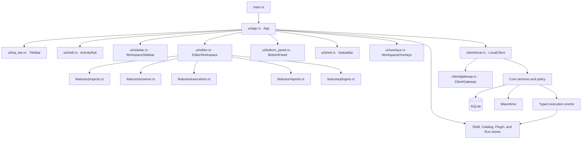

# Desktop UI

PolyGlid Desktop is a native Rust application built with Dioxus Desktop. Rust
components render the interface, Dioxus signals hold current UI state, and the
styles in `apps/desktop/assets/` define the workbench theme. There is no active
Tauri, React, TypeScript, or Tailwind frontend in this repository.

This document describes the implemented UI and calls out remaining migration
work explicitly. The target product boundary, permission model, state ownership,
and migration phases live in the canonical
[Client Architecture](CLIENT_ARCHITECTURE.md).

## Status Language

| Status | Meaning |
| --- | --- |
| Real | Reads or changes real local application data through a core service |
| Partial | Has real behavior but still lacks a required policy, state, or presentation detail |
| Removed | The unfinished surface and its seeded implementation are absent from production source |

## Current Surface Inventory

| Surface | Status | Current behavior | Remaining work |
| --- | --- | --- | --- |
| Window and workbench shell | Real | Dioxus window, product rail, contextual sidebar, open views, resizable panes, command palette | Complete feature-controller separation |
| Client boundary | Real foundation | UI-safe DTOs/errors, `ClientGateway`, `LocalClient`, bootstrap, and execution subscription | Extract stable contracts before a second client; remove gateway calls from views |
| Shell preferences | Real | Pane visibility and sizes persist through local settings | Persist any new shell preferences through the same boundary |
| Workspace selector | Real | Loads registered workspaces and changes the active workspace | Workspace registration UI |
| Projects | Real | Discovers, creates, renames, removes, and optionally deletes real folders | Project selection as explicit scan/report context |
| Plugin registry | Partial | Loads, validates, installs, enables, disables, and uninstalls valid WASM components under the configured signature policy | Official signed-component packaging and trust bootstrap |
| New scan | Partial | Uses a real target and installed plugin, shows live manifest capability requests/scopes, starts asynchronously, and returns a `JobId` | Resource-scope enforcement and persisted session/workspace decisions |
| Saved targets | Real | Validates, persists, selects, and removes local targets | Project grouping and richer target metadata |
| Executions | Real foundation | Shows local job history and states, opens reports, and requests cancellation | Rich progress stages, cancellation confirmation, and event reconnect polish |
| Reports | Real | Loads persisted reports, shows real severity/findings, and exports JSON, Markdown, or SARIF | Report filters and optional HTML action in the UI |
| Findings panel | Real | Shows findings from the selected persisted report | Selection context polish |
| Activity panel | Partial | Shows safe local lifecycle messages and errors | Complete typed execution-log/event history |
| Settings | Partial | Shows real local counts and applies the fuel limit to new jobs | Persist execution settings and expose validated host health |
| Work Tracks, Automation, and AI Agents | Removed | Seeded preview modules and routing were deleted | Design real services before adding new implementations |
| Source preview and terminal | Removed | Placeholder source and terminal implementations were deleted | Add only with a real, justified service and security design |

The capability review is an allow-once gate. It starts with nothing selected,
requires every capability kind requested by the executable, rejects extra or
missing approvals, and writes audit events. Installation and enablement are not
execution approval. Durable approval IDs, enforcement of the displayed
manifest resource scopes, expiration, and session/workspace decisions remain
part of the MVP security work.

### Current release trust blocker

Balanced policy requires a valid adjacent component signature. The v0.10.0
release includes `recon-probe.component.wasm` but not its
`recon-probe.component.sig`, so that bundled component cannot be installed
safely under the default policy. Do not weaken the client policy to hide this
packaging failure. Release hardening must establish an offline long-lived
Ed25519 signing identity, protect its seed in CI secrets, pin the official
public key/fingerprint for trust bootstrap, sign and verify the release
component, package both files, and publish a new signed release.

## Current Composition



## Module Ownership

Paths below are relative to `apps/desktop/src/`.

| Module | Current responsibility |
| --- | --- |
| `main.rs` | Configures and launches the Dioxus window |
| `client/models.rs` | UI-safe workspaces, projects, plugins, targets, jobs, reports, and capability DTOs |
| `client/error.rs` | Typed, presentation-safe client failures |
| `client/gateway.rs` | `ClientGateway` operations and execution subscription |
| `client/local.rs` | Local adapter over core services, SQLite, plugin manager, and execution manager |
| `ui/app.rs` | Creates contexts, loads the bootstrap snapshot, watches operational changes, and composes the shell |
| `ui/state.rs` | Composes `ShellStore`, `CatalogStore`, `PluginStore`, and `RunStore` |
| `ui/models.rs` | Navigation, overlay, permission-review, and presentation models |
| `ui/commands.rs` | Product navigation shortcuts and shell-preference persistence |
| `ui/top_bar.rs` | Brand, workspace picker, command entry, live local status, and notifications |
| `ui/shell.rs` | Product activity rail and status bar |
| `ui/sidebar.rs` | Project, target, execution, report, and plugin sidebars |
| `ui/editor.rs` | Open-view routing and current local-client action wiring |
| `ui/bottom_panel.rs` | Persisted findings and local activity |
| `ui/overlays.rs` | Settings, commands, plugin inspection/install, permission review, and safe errors |
| `ui/features/projects.rs` | Real workspace project management |
| `ui/features/scanner.rs` | Scan draft and requested-capability summary |
| `ui/features/executions.rs` | Real execution history, state, cancellation, and report routing |
| `ui/features/reports.rs` | Persisted report detail and file export |
| `ui/features/plugins.rs` | Real plugin registry management |
| `ui/components.rs` | Small reusable presentational controls |

Theme and component CSS live under `apps/desktop/assets/`. Components consume
shared colors, spacing, focus, disabled, busy, and status tokens from
`theme.css`. Feature rules must not redefine global semantics.

## Current State Ownership

The first state split replaces the former flat signal collection:

| Store | Current ownership |
| --- | --- |
| `ShellStore` | active/open views, pane state, resizing, bottom tab, settings tab, and one overlay enum |
| `CatalogStore` | workspace/project snapshot, active workspace, refresh, load state, and catalog error |
| `PluginStore` | installed components, selection, and install path draft |
| `RunStore` | saved targets, execution/report history, active job, activity, error, and fuel draft |

This is clearer than a monolithic `AppState`, but it is still an intermediate
shape. Scanner, Executions, Reports, and Settings gain their own controllers
and stores as their behavior grows; see
[Desktop State Ownership](CLIENT_ARCHITECTURE.md#desktop-state-ownership).

## Current Runtime Paths

### Startup

```text
App starts
  -> LocalClient opens the configured desktop data directory
  -> one bootstrap query loads workspace, projects, plugins, saved targets,
     execution history, reports, and shell preferences
  -> feature stores receive UI-safe DTOs
  -> Dioxus renders the product navigation
  -> execution events refresh affected operational state
```

`POLYGLID_DATA_DIR` overrides the default `~/.polyglid` data directory.
`POLYGLID_WORKSPACE_ROOT` overrides the default project root.

### Plugin installation

```text
choose .wasm file
  -> LocalClient validates the executable and manifest
  -> UI shows identity plus every requested capability and scope
  -> operator confirms installation
  -> plugin manager registers the component
  -> plugin store updates
```

The install action changes the registry only. It does not approve a future run.

### Scan execution

```text
choose target and enabled plugin
  -> open allow-once permission review with nothing selected
  -> approve every requested capability kind or deny/cancel
  -> LocalClient re-inspects the installed executable
  -> core rejects missing or unexpected approvals
  -> start_execution returns JobId immediately
  -> UI opens Executions
  -> typed events and refreshes update job/report state
  -> completed report is persisted and available under Reports
```

### Report export

```text
select persisted report
  -> choose JSON, Markdown, or SARIF
  -> choose destination with native save dialog
  -> LocalClient creates the typed export payload
  -> UI writes the selected file and records a safe activity message
```

## Workbench Regions

```text
+--------------------------------------------------------------------+
| Brand / workspace | Command center | local status and user actions  |
+----+----------------+-----------------------------------------------+
|    | Context sidebar| Open product views                            |
| R  |                +-----------------------------------------------+
| a  |                | Active Projects / Scan / Executions /         |
| i  |                | Reports / Plugins view                        |
| l  |                +-----------------------------------------------+
|    |                | Findings / Activity                           |
+----+----------------+-----------------------------------------------+
| Catalog, active execution, project, and report status               |
+--------------------------------------------------------------------+
```

- The rail contains only real product areas.
- The sidebar contains controls or navigation for the active area.
- The editor holds the primary task and closable product-view tabs.
- The bottom panel contains secondary findings and activity, never the only
  copy of a permission decision or failure.
- Overlays are reserved for short, focused decisions.

## Product Navigation

1. **Projects** — create and manage the local project context.
2. **New scan** — select a target and plugin and begin permission review.
3. **Executions** — watch job states, cancel active work, and open its report.
4. **Reports** — reopen real findings and export persisted evidence.
5. **Plugins** — inspect, install, select, enable, disable, and remove components.
6. **Settings** — inspect local state and set current execution limits.

Work Tracks, Automation, AI Agents, source preview, and Terminal are absent from
the production source and active product navigation. Add them again only after
their visible data and actions are backed by real application services.

## Component Contract

A production page must be understandable from its public inputs without reading
database or runtime code.

### Page component

A page receives one view model and explicit actions:

```text
ScannerPage
  state: ScannerViewModel
  on_target_changed(TargetDraft)
  on_plugin_selected(PluginId)
  on_review_permissions()

PermissionReview
  state: PermissionReviewViewModel
  on_capability_changed(CapabilityKind, approved)
  on_deny()
  on_start_once(ApprovedRunDraft)
```

The page does not construct core `ExecutionConfig`, infer grants from plugin
enablement, or wait directly on a runtime receiver.

### Presentational component

A reusable component:

- has one visual responsibility;
- receives display-ready values and typed callbacks;
- has no database, runtime, gateway, or feature-store dependency;
- has an accessible name and visible focus state when interactive;
- deliberately renders disabled, loading, empty, and error states;
- never embeds fabricated production data.

Examples include tab buttons, status badges, permission rows, execution rows,
finding rows, export buttons, and empty-state panels.

### Controller

A feature controller:

- validates presentation input into a typed command;
- is the only layer that calls `ClientGateway` for that feature;
- writes only its feature store;
- correlates events by stable workspace, job, and report IDs;
- maps safe client errors into actionable view state;
- changes navigation only after an operation is accepted.

The current UI-safe gateway is real, but several Dioxus wiring components still
call `LocalClient` directly. Moving those calls into controllers is the next
separation step; do not add new direct calls in leaf components.

## Required State Presentation

Every data-backed page distinguishes:

- initial loading;
- empty data with a useful next action;
- ready data;
- a recoverable error with retry guidance;
- stale data while refresh is in progress;
- a mutation waiting for acceptance.

Execution additionally distinguishes queued, starting, running, cancelling,
cancelled, timed out, failed, and completed. Cancellation remains pending until
the host confirms a terminal state.

## Dialog and Permission Rules

- A dialog title names the user decision, not the implementation type.
- Destructive actions state what happens to records and files separately.
- The default focused action is safe; destructive confirmation is never tied to
  an ambiguous Enter key.
- Capability review lists the capability, risk, target, and manifest scope in
  plain language.
- Closing permission review is denial, never implicit approval.
- Installation confirmation and execution approval are separate operations.
- Future allow-session/workspace choices must show expiration and revocation.

## Accessibility and Clarity

- Icon-only buttons have accessible names and tooltips.
- Keyboard focus is visible and follows opened/closed overlays.
- Color supplements text or icons; it is never the only status signal.
- Busy and disabled actions remain readable and explain their prerequisite.
- Errors stay visible until dismissal or a successful retry supersedes them.
- Real metrics identify their source; no seeded score is presented as live.
- The 900 x 620 minimum window remains usable, while CSS degrades safely on
  narrower layouts.

## Adding a Production Feature

1. Add or reuse typed operations and DTOs at the client boundary.
2. Implement the local operation through an application/core service.
3. Define the feature store and every asynchronous state.
4. Implement a controller as the gateway caller and store writer.
5. Build presentational components from view models and typed actions.
6. Add controller transition and component-state tests.
7. Add one integration path using `LocalClient`.
8. Update the surface inventory above.

A surface becomes Real only when its visible values and actions are backed by
the application host and security policy. CSS completeness or seeded data does
not change its status.
