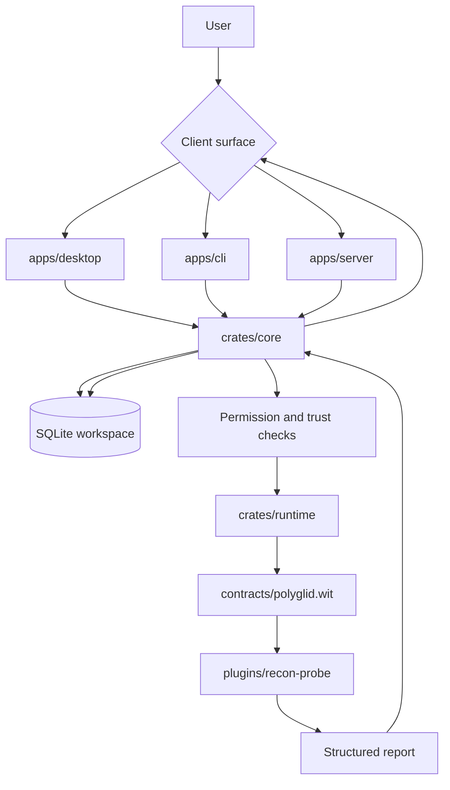
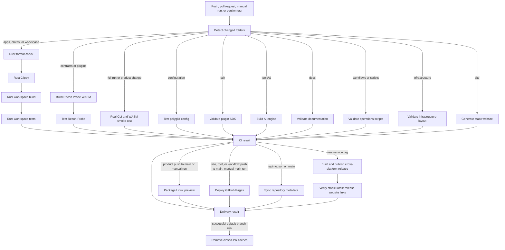
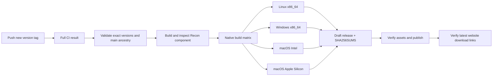

# PolyGlid Project Flow

This document records the canonical repository ownership model and shows what happens after each development or runtime action.

## Canonical Repository Layout

```text
polyglid/
├── apps/                 # Desktop, CLI, and server clients
├── crates/               # Reusable Rust engine libraries
├── contracts/            # Language-neutral WIT contracts
├── plugins/              # First-party sandboxed WASM plugins
├── site/                 # Public static website generator
├── sdk/                  # Plugin templates and language SDKs
├── tools/                # Internal AI and workspace automation
├── scripts/ops/          # Stable operations CLI
├── infrastructure/       # Deployment and external services
├── tests/                # Workspace-level tests
├── extensions/           # IDE and browser integrations
├── releases/             # Release and packaging definitions
└── docs/                 # Architecture and operating knowledge
```

The retired `slices/` tree must not be recreated. Vertical slices remain a development method, not a source-directory name. Every component has exactly one canonical location.

## Runtime Flow



## Feature Development Flow

```mermaid
flowchart LR
    Plan --> Contract[Define domain or WIT contract]
    Contract --> Core[Implement core behavior]
    Core --> Tests[Test policy and failure paths]
    Tests --> Adapter[Implement runtime or storage adapter]
    Adapter --> Client[Connect desktop, CLI, or server]
    Client --> E2E[Verify end to end]
    E2E --> Docs[Update documentation]
    Docs --> CI[Run CI quality gates]
```



The required dependency direction is `contract → core → adapter → client`. Clients must not bypass core services to access SQLite or Wasmtime directly.

## GitHub Automation Flow



- GitHub renders top-level jobs and reusable-workflow caller nodes in the run overview; opening a reusable call shows its nested jobs and steps.
- `ci.yml` detects changes and connects the validation, build, test, deployment, and final-result jobs.
- Pull requests and ordinary `main` pushes are selective. Manual runs, new version tags, workflow changes, and unknown paths force every validation branch.
- `deploy-site.yml` is a reusable workflow called by CI after a successful site build on `main`.
- `repo-sync.yml` is a reusable workflow called by CI when `repinfo.json` changes on `main`.
- The non-blocking `cache-cleanup` job in `ci.yml` runs after successful delivery, verifies pull-request state, preserves open-PR/default-branch caches, and deletes closed-PR caches.
- `scripts/ops/polyglid-ops.mjs` is the shared local and CI entry point.
- `docs/development/CI_DELIVERY.md` explains the event, preview, and release lifecycle step by step.

## Release Flow



## Generated State

Runtime databases, reports, build output, local application caches, and local
analytics are not source code. The root `.gitignore` excludes `polyglid.db`,
`reports/`, `target/`, and local workspace data. Remote GitHub Actions caches
are immutable acceleration data managed by CI: deleting one never deletes a
source file, artifact, deployment, or release.
