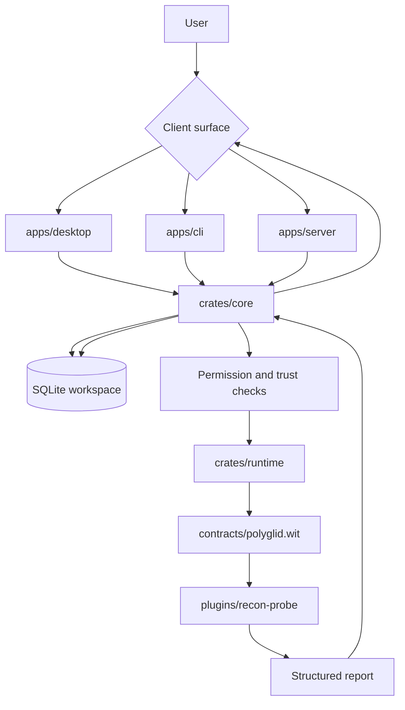
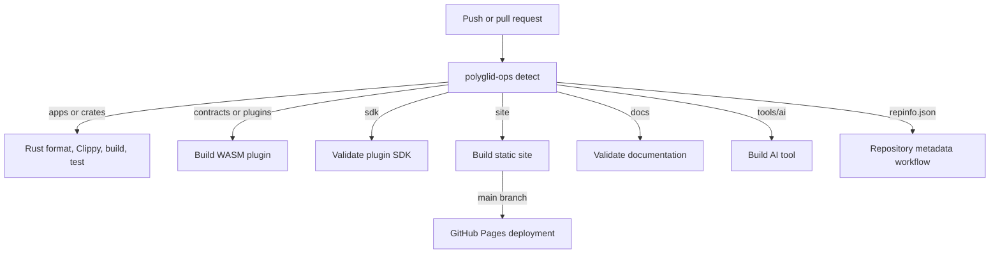
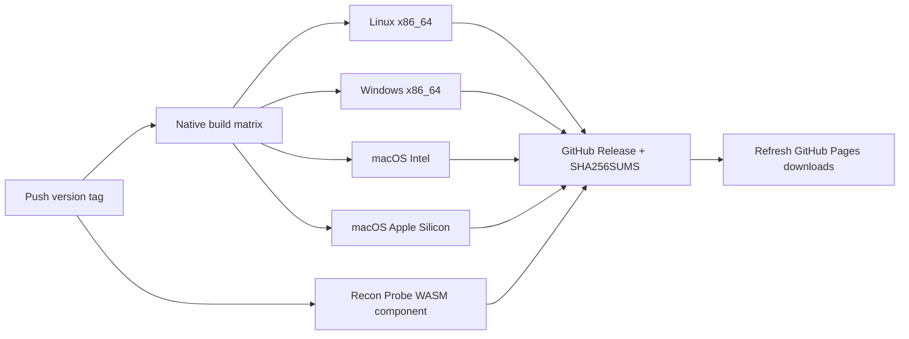

# PolyGlid Project Flow

This document records the canonical repository ownership model and shows what happens after each development or runtime action.

## Canonical Repository Layout

```text
polyglid/
├── apps/                 # Desktop, CLI, and server clients
├── crates/               # Reusable Rust engine libraries
├── contracts/            # Language-neutral WIT contracts
├── plugins/              # First-party sandboxed WASM plugins
├── site/                 # Public static website generator
├── sdk/                  # Plugin templates and language SDKs
├── tools/                # Internal AI and workspace automation
├── scripts/ops/          # Stable operations CLI
├── infrastructure/       # Deployment and external services
├── tests/                # Workspace-level tests
├── extensions/           # IDE and browser integrations
├── releases/             # Release and packaging definitions
└── docs/                 # Architecture and operating knowledge
```

The retired `slices/` tree must not be recreated. Vertical slices remain a development method, not a source-directory name. Every component has exactly one canonical location.

## Runtime Flow



## Feature Development Flow

```mermaid
flowchart LR
    Plan --> Contract[Define domain or WIT contract]
    Contract --> Core[Implement core behavior]
    Core --> Tests[Test policy and failure paths]
    Tests --> Adapter[Implement runtime or storage adapter]
    Adapter --> Client[Connect desktop, CLI, or server]
    Client --> E2E[Verify end to end]
    E2E --> Docs[Update documentation]
    Docs --> CI[Run CI quality gates]
```



The required dependency direction is `contract → core → adapter → client`. Clients must not bypass core services to access SQLite or Wasmtime directly.

## GitHub Automation Flow



- `ci.yml` detects changes and runs validation/build jobs.
- `deploy-site.yml` alone deploys the public website.
- `repo-sync.yml` alone updates GitHub repository metadata.
- `scripts/ops/polyglid-ops.mjs` is the shared local and CI entry point.

## Release Flow



## Generated State

Runtime databases, reports, build output, caches, and local analytics are not source code. The root `.gitignore` excludes `polyglid.db`, `reports/`, `target/`, and local workspace data.
