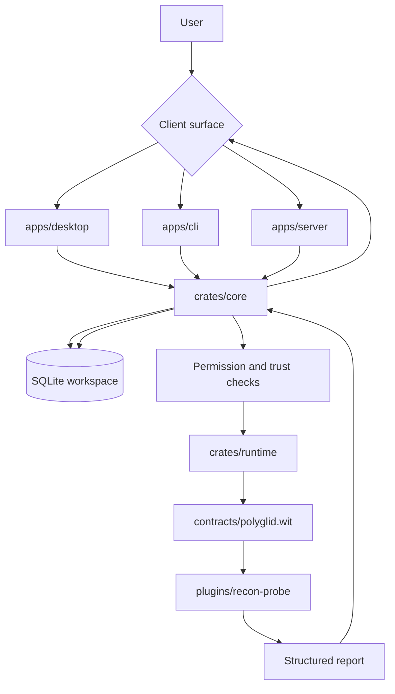
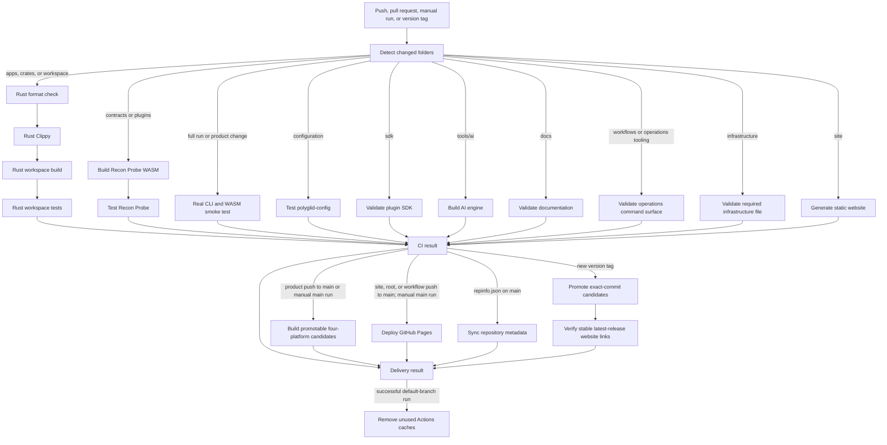
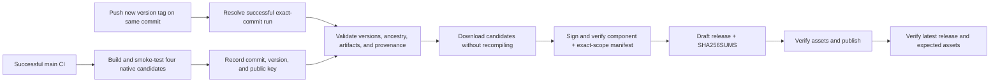

# PolyGlid Project Flow

This document records the canonical repository ownership model and shows what happens after each development or runtime action.

## Canonical Repository Layout

```text
polyglid/
├── apps/                 # Desktop, CLI, and server clients
├── crates/               # Reusable Rust engine libraries
├── contracts/            # Language-neutral WIT contracts
├── plugins/              # First-party sandboxed WASM plugins
├── site/                 # Public static website generator
├── sdk/                  # Rust plugin templates/examples; future language placeholders
├── tools/                # Experimental AI and compatibility automation
├── scripts/ops/          # Stable operations CLI
├── infrastructure/       # Legacy WPM SQL; no active deployment stack
├── tests/                # Reserved workspace-level test area
└── docs/                 # Architecture and operating knowledge
```

The retired `slices/` tree must not be recreated. Vertical slices remain a development method, not a source-directory name. Every component has exactly one canonical location.

## Runtime Flow


```mermaid
flowchart TD
    User --> Client{Client surface}
    Client --> Desktop[apps/desktop]
    Client --> CLI[apps/cli]
    Client --> Server[apps/server]
    Desktop --> Core[crates/core]
    CLI --> Core
    Server --> Core
    Core --> Store[(SQLite workspace)]
    Core --> Security[Permission and trust checks]
    Security --> Runtime[crates/runtime]
    Runtime --> Contract[contracts/polyglid.wit]
    Contract --> Plugin[plugins/recon-probe]
    Plugin --> Report[Structured report]
    Report --> Core
    Core --> Store
    Core --> Client
```

## Feature Development Flow


```mermaid
flowchart LR
    Plan --> Contract[Define domain or WIT contract]
    Contract --> Core[Implement core behavior]
    Core --> Tests[Test policy and failure paths]
    Tests --> Adapter[Implement runtime or storage adapter]
    Adapter --> Client[Connect desktop, CLI, or server]
    Client --> E2E[Verify end to end]
    E2E --> Docs[Update documentation]
    Docs --> CI[Run CI quality gates]
```

The required dependency direction is `contract → core → adapter → client`. Clients must not bypass core services to access SQLite or Wasmtime directly.

## GitHub Automation Flow


```mermaid
flowchart TD
    Event[Push, pull request, manual run, or version tag] --> Detect[Detect changed folders]

    Detect -->|apps, crates, or workspace| Format[Rust format check]
    Format --> Clippy[Rust Clippy]
    Clippy --> Build[Rust workspace build]
    Build --> Tests[Rust workspace tests]

    Detect -->|contracts or plugins| WasmBuild[Build Recon Probe WASM]
    WasmBuild --> WasmTest[Test Recon Probe]

    Detect -->|configuration| Config[Test polyglid-config]
    Detect -->|sdk| SDK[Validate plugin SDK]
    Detect -->|tools/ai| AI[Build AI engine]
    Detect -->|docs| Docs[Validate documentation]
    Detect -->|workflows or operations tooling| Ops[Validate operations command surface]
    Detect -->|infrastructure| Infra[Validate required infrastructure file]

    Detect -->|site| SiteBuild[Generate static website]
    Detect -->|full run or product change| Smoke[Real CLI and WASM smoke test]

    Tests --> Result[CI result]
    WasmTest --> Result
    Smoke --> Result
    Config --> Result
    SDK --> Result
    AI --> Result
    Docs --> Result
    Ops --> Result
    Infra --> Result
    SiteBuild --> Result

    Result --> DeliveryResult[Delivery result]
    Result -->|product push to main or manual main run| Candidate[Build promotable four-platform candidates]
    Result -->|site, root, or workflow push to main; manual main run| Pages[Deploy GitHub Pages]
    Result -->|repinfo.json on main| Metadata[Sync repository metadata]
    Result -->|new version tag| Release[Promote exact-commit candidates]
    Release --> Latest[Verify stable latest-release website links]
    Candidate --> DeliveryResult
    Pages --> DeliveryResult
    Metadata --> DeliveryResult
    Latest --> DeliveryResult
    DeliveryResult -->|successful default-branch run| Cache[Remove unused Actions caches]
```

- GitHub renders top-level jobs and reusable-workflow caller nodes in the run overview; opening a reusable call shows its nested jobs and steps.
- `ci.yml` detects changes and connects the validation, build, test, deployment, and final-result jobs.
- Rust format, Clippy, build, nextest, and doctests share one runner job; WASM build and tests share another. Formal release validation, signing, publication, and verification also share one runner job.
- Pull requests and ordinary `main` pushes are selective. Manual runs, workflow changes, and unknown paths force every validation branch. Version tags promote artifacts from an already successful exact-commit `main` run.
- `deploy-site.yml` is a reusable workflow called by CI after a successful site build on `main`.
- `repo-sync.yml` is a reusable workflow called by CI when `repinfo.json` changes on `main`.
- The non-blocking `cache-cleanup` job in `ci.yml` runs after successful delivery, deletes closed-PR caches, and retains only the most recently accessed cache in each matching default-branch `v0-rust-…-<8 hex>-<8 hex>` family.
- `scripts/ops/polyglid-ops.mjs` is the shared local and CI entry point.
- `docs/development/CI_DELIVERY.md` explains the event, candidate, and release lifecycle step by step.

## Release Flow


```mermaid
flowchart LR
    Main[Successful main CI] --> Candidates[Build and smoke-test four native candidates]
    Candidates --> Provenance[Record commit, version, and public key]
    Tag[Push new version tag on same commit] --> Resolve[Resolve successful exact-commit run]
    Resolve --> Preflight[Validate versions, ancestry, artifacts, and provenance]
    Provenance --> Preflight
    Preflight --> Promote[Download candidates without recompiling]
    Promote --> Sign[Sign and verify component + exact-scope manifest]
    Sign --> Draft[Draft release + SHA256SUMS]
    Draft --> Publish[Verify assets and publish]
    Publish --> Website[Verify latest release and expected assets]
```

## Generated State

Runtime databases, reports, build output, local application caches, and local
analytics are not source code. The root `.gitignore` excludes `polyglid.db`,
`reports/`, `target/`, and local workspace data. Remote GitHub Actions caches
are immutable acceleration data managed by CI: deleting one never deletes a
source file, artifact, deployment, or release.
