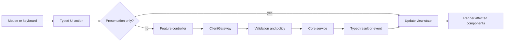
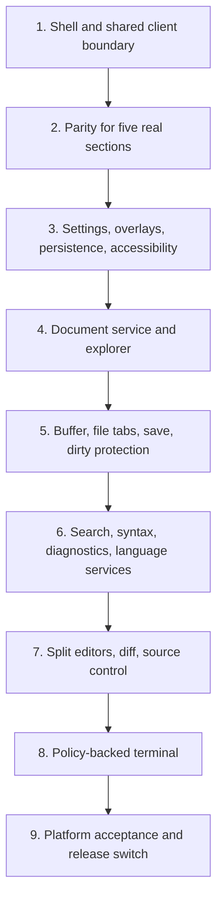

# Workbench Component and Functionality Map

This is the complete map of the PolyGlid native-client surface. It separates
the production Dioxus behavior, the GPUI migration shell, and future features
that still need real application services.

## Status

| Status | Meaning |
| --- | --- |
| Real | Connected to persisted application data and a real controller |
| Shell | Interactive presentation exists, but feature mutations are not connected |
| Partial | Some real behavior exists, but the complete journey is missing |
| Designed | Component and boundary are mapped; implementation has not started |
| Excluded | Intentionally outside the current product scope |

## Complete Component Tree

```text
PolyGlidApplication
├── NativeWindow
│   ├── TitleBar
│   │   ├── ProductMenu
│   │   ├── WorkspaceSwitcher
│   │   ├── CommandCenter
│   │   ├── RuntimeStatus
│   │   └── UserAndSettingsActions
│   ├── WorkbenchBody
│   │   ├── ActivityRail
│   │   │   ├── Projects
│   │   │   ├── Scanner
│   │   │   ├── Executions
│   │   │   ├── Reports
│   │   │   ├── Plugins
│   │   │   └── Settings
│   │   ├── ContextSidebar
│   │   │   ├── ProjectsSidebar
│   │   │   ├── ScannerSidebar
│   │   │   ├── ExecutionsSidebar
│   │   │   ├── ReportsSidebar
│   │   │   ├── PluginsSidebar
│   │   │   ├── ExplorerSidebar
│   │   │   └── SearchSidebar
│   │   └── MainArea
│   │       ├── EditorTabBar
│   │       ├── ActiveEditor
│   │       │   ├── ProjectsDashboard
│   │       │   ├── ScannerDashboard
│   │       │   ├── ExecutionsDashboard
│   │       │   ├── ReportsDashboard
│   │       │   ├── PluginsDashboard
│   │       │   ├── CodeEditor
│   │       │   ├── DiffEditor
│   │       │   └── SettingsEditor
│   │       └── BottomDock
│   │           ├── FindingsPanel
│   │           ├── ActivityPanel
│   │           ├── DiagnosticsPanel
│   │           ├── OutputPanel
│   │           └── TerminalPanel
│   ├── StatusBar
│   └── OverlayLayer
│       ├── CommandPalette
│       ├── QuickOpen
│       ├── Settings
│       ├── PluginInstallReview
│       ├── PermissionReview
│       ├── ConfirmationDialog
│       ├── ErrorDialog
│       └── Notifications
└── SharedClientBoundary
    ├── ApplicationController
    ├── ProjectsController
    ├── ScannerController
    ├── ExecutionsController
    ├── ReportsController
    ├── PluginsController
    ├── SettingsController
    ├── DocumentsController
    ├── SearchController
    ├── TerminalController
    └── SourceControlController
```

The last four controllers are target architecture and do not exist today.

## Source Ownership

| Layer | Source | Responsibility |
| --- | --- | --- |
| Dioxus application | `apps/desktop/src/ui/app.rs` | Bootstrap, refresh, event subscription, resize, shortcuts |
| Dioxus shell | `apps/desktop/src/ui/shell.rs` | Activity rail and status bar |
| Dioxus title bar | `apps/desktop/src/ui/top_bar.rs` | Workspace, commands, product and user actions |
| Dioxus sidebar | `apps/desktop/src/ui/sidebar.rs` | Context navigation and secondary actions |
| Dioxus editor | `apps/desktop/src/ui/editor.rs` | Section tabs and active feature page |
| Dioxus dock | `apps/desktop/src/ui/bottom_panel.rs` | Findings and activity |
| Dioxus overlays | `apps/desktop/src/ui/overlays.rs` | Settings, commands, install, permissions, errors |
| Dioxus state | `apps/desktop/src/ui/state.rs` | Shell, catalog, plugin, and run presentation state |
| GPUI application | `apps/workbench/src/lib.rs` | Native window and key bindings |
| GPUI shell | `apps/workbench/src/workbench.rs` | Native workbench and real bootstrap refresh |
| GPUI state/actions | `apps/workbench/src/models.rs`, `actions.rs` | Tabs, active view, panels, selection, commands |
| Shared DTOs | `crates/client/src/models.rs` | UI-safe data |
| Gateway | `crates/client/src/gateway.rs` | Presentation-to-application contract |
| Local adapter | `crates/client/src/local.rs` | Core-backed in-process implementation |
| Controllers | `crates/client/src/controllers.rs` | Shared feature operations |

## Global Shell

| Component | Functionality | Dioxus | GPUI |
| --- | --- | --- | --- |
| Native window | Focus, resize, close, platform window | Real | Shell |
| Title bar | Product and active-workspace identity | Real | Shell |
| Product menu | Commands and product actions | Real | Designed |
| Workspace switcher | List and activate workspace | Real | Designed |
| Command center | Search and dispatch actions | Real | Shell |
| Activity rail | Open product sections | Real | Shell |
| Context sidebar | Navigation for active section | Real | Shell with real snapshot |
| Editor tabs | Open, activate, close, cycle | Real | Shell, unit tested |
| Split editor groups | Side-by-side editors | Designed | Designed |
| Bottom dock | Findings, activity, diagnostics, output, terminal | Partial | Shell |
| Status bar | Workspace, runtime, counts, panel control | Real foundation | Shell |
| Overlay layer | Modal decisions and transient messages | Real | Command palette shell |
| Theme system | Color, spacing, type, severity, focus | Real CSS | Initial tokens |

## Product Sections

### Projects

| Component/function | Boundary | Status |
| --- | --- | --- |
| Project list with loading, empty, ready, and error states | Bootstrap/catalog | Real in Dioxus |
| Refresh discovery | Catalog refresh | Real |
| Create project | `ProjectsController::create` | Real |
| Select project | Presentation context | Real |
| Rename project | `ProjectsController::rename` | Real |
| Remove catalog entry | `ProjectsController::remove(..., false)` | Real |
| Confirm and delete files | `ProjectsController::remove(..., true)` | Real |
| Register another workspace | Gateway exists; controller/UI missing | Partial |
| Browse project files | `DocumentsController` required | Designed |

### Scanner

| Component/function | Boundary | Status |
| --- | --- | --- |
| Add, select, filter, and remove saved targets | `ScannerController` | Real |
| Select enabled plugin | Plugin snapshot | Real |
| Show exact capability and scope requests | Manifest DTO | Real |
| Allow or deny each permission | `record_decision` | Real |
| Once/session/workspace approval duration | Approval policy | Real |
| Start validated asynchronous execution | `ScannerController::start` | Real |
| Prevent duplicate active start | Execution state | Real |
| Reusable scan templates | Template service required | Designed |

### Executions

| Component/function | Boundary | Status |
| --- | --- | --- |
| Recent execution navigation | Execution snapshot | Real |
| Active execution card | Typed events | Real foundation |
| State, duration, fuel, errors, report link | Execution DTO | Real |
| Cancel execution | `ExecutionsController::cancel` | Real |
| Open persisted report | Report selection | Real |
| Live structured stages and logs | Richer event model required | Partial |
| Retry execution | New controller operation | Designed |
| Compare performance/findings | Comparison query required | Designed |

### Reports

| Component/function | Boundary | Status |
| --- | --- | --- |
| Select persisted reports | Report snapshot | Real |
| Summary and severity totals | Report DTO | Real |
| Finding title, severity, description, recommendation | Issue DTO | Real |
| Findings dock panel | Selected report state | Real |
| JSON, Markdown, SARIF export | `ReportsController::export` | Real |
| HTML export | Gateway supports it; UI action missing | Partial |
| Project/target/severity/plugin/date filters | Filter query required | Designed |
| Compare reports | Comparison service required | Designed |

### Plugins

| Component/function | Boundary | Status |
| --- | --- | --- |
| Registry and selected plugin | Plugin snapshot | Real |
| Native WASM file chooser | Native dialog | Real in Dioxus |
| Manifest/signature/capability inspection | `PluginsController::inspect` | Real |
| Install validated component | `PluginsController::install` | Real |
| Enable or disable | `set_enabled` | Real |
| Uninstall | `uninstall` | Real |
| Capability badges | Plugin DTO | Real |
| Full publisher/checksum/trust page | DTO exists; page incomplete | Partial |
| Verified updates | Update repository service required | Designed |

## Tabs and Editor Groups

Three concepts must remain separate:

| Concept | Meaning | Examples |
| --- | --- | --- |
| Product section | Top-level capability selected from the rail | Projects, Scanner |
| Editor tab | Open page or document in an editor group | `Projects`, `README.md`, report |
| Panel tab | Tool in the bottom dock | Findings, Activity, Terminal |

Target editor model:

```text
Workbench
└── EditorGroup[]
    ├── active_item_id
    └── items[]
        ├── Dashboard(section)
        ├── Document(project_id, relative_path)
        ├── Diff(project_id, relative_path, base_revision)
        ├── Report(report_id)
        ├── Plugin(plugin_id)
        └── Settings(page)
```

Every item needs a stable ID, title, dirty state, preview/pinned state, close
policy, restoration payload, and view state. Product dashboards are singletons;
documents and reports are keyed by their stable identity.

| Tab operation | Expected result | Status |
| --- | --- | --- |
| Open section | Reuse singleton or append tab | Real in both clients |
| Activate | Change active item without losing state | Real for sections |
| Close | Select neighbor and keep group valid | Real for sections |
| Next/previous | Cycle active group | Next exists in GPUI |
| Reorder | Drag within a group | Designed |
| Preview/pin | Reuse preview, then preserve when pinned | Designed |
| Split right/down | Create editor group | Designed |
| Move between groups | Transfer item state | Designed |
| Restore session | Restore groups and safe identities | Designed |

Closing a dirty document must present Save, Discard, and Cancel.

## Code Editor

The code editor is not implemented. It must not be a text box that directly
reads arbitrary filesystem paths.

```text
CodeEditorItem
├── BreadcrumbBar
├── EditorToolbar
├── TextViewport
│   ├── GutterAndLineNumbers
│   ├── SelectionAndCursorLayer
│   ├── SyntaxLayer
│   ├── InlineDiagnostics
│   └── ScrollbarsAndMinimap
├── FindReplaceBar
├── CompletionPopover
├── HoverPopover
└── EditorStatus
```

| Capability | Required behavior/service | Status |
| --- | --- | --- |
| Open file | Resolve authorized project-relative path | Designed |
| Text buffer | UTF-8 and line-ending aware editing with undo/redo | Designed |
| Save | Atomic write with external-change detection | Designed |
| Save as | Explicit policy for paths outside project | Designed |
| Dirty protection | Protect close, reload, workspace switch, and exit | Designed |
| Syntax | Language detection and incremental highlighting | Designed |
| Find/replace | Case, whole-word, and regex controls | Designed |
| Workspace search | Stream bounded project results | Designed |
| Go to file/symbol | Indexed fuzzy navigation | Designed |
| Diagnostics | Parse, build, lint, and security diagnostics | Designed |
| Completion/hover | Language-service results | Designed |
| Formatting | Preview and apply formatter edits | Designed |
| Diff | Read-only/staged comparison and explicit apply | Designed |
| Large/binary files | Refuse or use a safe specialized viewer | Designed |

The document boundary receives `(workspace_id, project_id, relative_path)`.
It canonicalizes the path and rejects traversal, symlink escape, and out-of-root
writes. Views never receive a general filesystem handle.

## Terminal, Output, and Activity

| Panel | Purpose | Can execute processes? |
| --- | --- | --- |
| Activity | Safe product lifecycle and audit messages | No |
| Output | Structured output from a trusted task or plugin | No |
| Terminal | Interactive pseudo-terminal | Yes, after explicit policy |

The terminal is not implemented. Its target tree is:

```text
TerminalDock
├── TerminalTabBar
├── SessionToolbar
├── TerminalViewport
├── SearchOverlay
└── SessionStatus
```

`TerminalController` must own PTY creation, approved shell selection, project
working directory, filtered environment, resize, input, output streaming, and
termination. Plugins never receive process access through the terminal UI.

## Settings

| Tab | Existing | Target | Status |
| --- | --- | --- | --- |
| Overview | Counts and workspace summary | Paths, version, health, update channel | Partial |
| Execution | Fuel, timeout, memory | Concurrency, cancellation grace, retention | Real foundation |
| Plugins | Registry/policy summary | Publishers, approvals, revocation, sources | Partial |
| Appearance | None | Theme, font, density, reduced motion | Designed |
| Editor | None | Font, tab width, wrap, autosave, format | Designed |
| Key bindings | Command list | Searchable editable bindings | Designed |
| Terminal | None | Shell, font, environment policy | Designed |
| Privacy/security | Execution review | Approval and audit management | Designed |

## Overlays and Dialogs

| Overlay | Trigger | Completion |
| --- | --- | --- |
| Command palette | Command center/shortcut | Dispatch action and close |
| Quick open | File-open shortcut | Open safe project document |
| Plugin install review | Validate component | Install or cancel |
| Permission review | Start scan | Record decisions, then start or deny |
| Settings | Rail/title bar/command | Persist validated values |
| Confirmation | Destructive or dirty action | Confirm, cancel, safer option |
| Error | Safe client error | Acknowledge or retry |
| Notification | Background completion | Dismiss or open related item |

Escape may close a dismissible overlay but never silently approve, discard,
delete, install, or execute.

## State Ownership

| Store/model | Owns | Must not own |
| --- | --- | --- |
| Shell | Layout, tabs, panels, overlays | Database/runtime handles |
| Catalog | Workspaces, projects, selection | File contents |
| Plugins | Registry, selection, inspection | Permission grants |
| Runs | Targets, executions, reports, activity | Runtime engine |
| Editor | Groups, document IDs, buffers, selections | Arbitrary filesystem access |
| Terminal | Session IDs and presentation | Child-process implementation |

## Interaction Flow



Example scan flow:

```text
Select project and target
  -> select enabled plugin
  -> review exact capabilities and scopes
  -> record each permission decision
  -> submit StartExecutionRequest
  -> receive JobId
  -> execution events update Executions
  -> completion persists Report
  -> Reports and Findings render evidence
```

Target file flow:

```text
Select project-relative path
  -> DocumentsController authorizes canonical path
  -> open or reuse Document tab
  -> load buffer and metadata
  -> edits mark tab dirty
  -> save performs atomic conflict-aware write
```

## Commands

| Command | Binding | State |
| --- | --- | --- |
| Command palette | `Ctrl/Cmd+K` or current client equivalent | Existing |
| Toggle sidebar | `Ctrl/Cmd+B` | Existing |
| Toggle bottom panel | `Ctrl/Cmd+J` | Existing |
| Projects through Plugins | `Ctrl/Cmd+1` through `5` | Existing |
| Close tab | `Ctrl/Cmd+W` | GPUI |
| Next tab | `Ctrl+Tab` | GPUI |
| Refresh | `Ctrl/Cmd+R` | GPUI |
| Escape | `Escape` | Existing |
| Quick open | `Ctrl/Cmd+P` | Designed |
| Save | `Ctrl/Cmd+S` | Designed |
| Find | `Ctrl/Cmd+F` | Designed |
| Workspace search | `Ctrl/Cmd+Shift+F` | Designed |
| New terminal | `` Ctrl+` `` | Designed |

Bindings must be normalized before GPUI becomes primary so command palette and
quick open do not conflict.

## Implementation Order



Milestone 1 is implemented. Milestone 2 is next: reproduce the five real
Dioxus workflows through `polyglid-client` before adding code editing or a
terminal.

## Completion Rule

A component is complete only when it:

- renders loading, empty, ready, pending, stale, and safe error states where
  applicable;
- defines keyboard, pointer, focus, and accessible-name behavior;
- confirms destructive actions;
- sends mutations through a feature controller;
- uses stable IDs instead of display names or raw paths;
- persists required state;
- has state-transition tests and controller-boundary tests;
- is marked Real only after its full journey passes.
