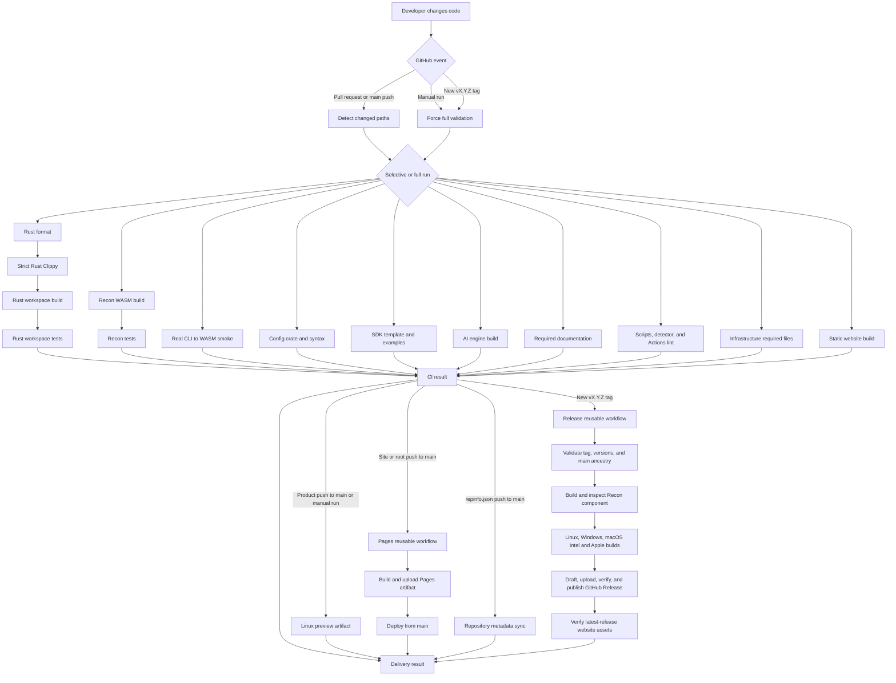

# CI And Delivery Lifecycle

PolyGlid uses `.github/workflows/ci.yml` as the single entry point for pull
requests, changes on `main`, manual full checks, preview builds, and formal
version releases. An ordinary commit can create a temporary preview, but it
cannot create a GitHub Release.

## Complete Flow



The top-level Actions overview renders jobs and their dependencies. Reusable
workflow calls such as Pages, metadata sync, and release appear as caller nodes;
open one to see its nested jobs and steps. Some boxes above expand a job's
important internal steps, so the documentation is more detailed than the
top-level GitHub graph.

## Why A Job Runs

| Changed path or event | Job or chain | What it proves | What happens next |
| --- | --- | --- | --- |
| `apps/**`, `crates/**`, `Cargo.toml`, or `Cargo.lock` | Format → Clippy → build → tests | Rust is formatted, warning-free under Clippy, compilable, and tested | Feeds `CI result` |
| `plugins/**`, `contracts/**`, or WIT files | Rust chain and WASM build → tests | Host code and Recon guest compile; plugin tests pass | Feeds `CI result` |
| Product code, WASM, scripts, or root build files | MVP smoke | The real CLI componentizes and runs Recon against `localhost`, then writes the exact expected report | Feeds `CI result` |
| `crates/config/**` or `configs/**` | Config | Rust config tests and JavaScript config syntax pass | Feeds `CI result` |
| `sdk/**` | SDK | Template, Hello World, and Recon examples compile for `wasm32-wasip1` from the locked SDK workspace | Feeds `CI result` |
| `tools/ai/**` | AI | The separately locked AI engine builds in release mode | Feeds `CI result` |
| `docs/**` or root documentation | Docs | Required project and delivery documents exist and are non-empty | Feeds `CI result` |
| `.github/**` or `scripts/**` | Operations | Node and shell syntax, detector regression cases, and all Actions YAML pass | Workflow-definition changes force a full run |
| `infrastructure/**` | Infrastructure | The current required WPM SQL file exists and is non-empty | Feeds `CI result` |
| `site/**` or root Cargo version | Website build | The static site generator succeeds | May deploy Pages after `CI result` |
| `repinfo.json` | Metadata | The requested repository metadata is applied with the configured token | Runs only on `main` after `CI result` |
| Unknown or newly added path | Every validation branch | New project areas cannot receive an empty green run | `CI result` requires every branch to execute |
| Manual run or new version tag | Every validation branch | The complete repository gate passes, not only changed areas | Preview for manual; formal release for a new tag |

Selective pull-request and `main` runs intentionally show unrelated jobs in
gray. Gray means the job's path condition was false, or an upstream dependency
failed. On a manual or formal-release run, `CI result` rejects any skipped
validation branch. A green `Delivery result` means every branch that applied to
that event completed successfully.

## Event Outcomes

| Event | Validation scope | Delivery outcome |
| --- | --- | --- |
| Pull request to `main` | Changed areas; unknown/workflow changes force all | Validation only; no artifact, metadata write, deployment, or release |
| Push to `main` | Changed areas; unknown/workflow changes force all | Linux preview for product changes, Pages for site/root changes, metadata sync for `repinfo.json` |
| Manual **Run workflow** | Every validation branch | Linux preview retained for 14 days; never a formal release |
| Newly created tag such as `v0.10.0` | Every validation branch | Four native archives, Recon component, checksums, GitHub Release, and latest-link verification |
| Deleted or force-moved version tag | No release publication | The release condition rejects it |

## Preview Versions

A successful product push to `main`, or a manual run, creates an Actions
artifact named like:

```text
polyglid-v0.10.0-dev.b0cc556-linux-x86_64
```

The suffix is the first seven characters of the Git commit. The artifact
contains:

```text
polyglid-linux-preview.tar.gz
polyglid-linux-preview.tar.gz.sha256
```

Inside the archive are the Linux CLI, Linux desktop executable, Recon component,
README, and both license files. Preview artifacts expire after 14 days and are
not GitHub Releases.

## Formal Version Releases

The root workspace version and `plugins/recon-probe/polyglid.toml` must contain
the same release version. After the version change is reviewed and merged:

```bash
git switch main
git pull --ff-only
cargo test --locked --workspace --exclude polyglid-site
git tag v0.10.0
git push origin v0.10.0
```

Do not tag an unpushed local commit. Release preflight checks:

1. The tag has the exact `vMAJOR.MINOR.PATCH` form.
2. The root Cargo version matches the tag.
3. The Recon manifest version matches the tag.
4. The checked-out tag resolves to the commit being validated.
5. The tagged commit is contained in `origin/main`.

The release remains a draft while assets upload. The job verifies all expected
asset names before publishing, and a rerun can safely complete an existing
draft. The final website verification confirms that `releases/latest` points
to this tag and contains every download used by the public site.

## Website And Metadata

A site/root change on `main` calls `deploy-site.yml` only after `CI result`.
That nested workflow resolves the latest published GitHub Release, generates the
site, uploads the Pages artifact, and deploys it from `main`. If no public
release exists, download buttons remain hidden. Browser-side release discovery
updates the displayed version and reveals stable `releases/latest/download`
links as soon as the first release is published, so a tag workflow does not need
a tag-context Pages deployment.

A `repinfo.json` change on `main` calls `repo-sync.yml` after `CI result`.
It requires `GH_PAT`; a missing token fails `Delivery result`. Prefer a
fine-grained token or GitHub App limited to this repository and only the
metadata permissions actually required.

## Making The Flow Enforced

Workflow YAML makes checks visible, but it cannot protect a branch by itself.
After the first run creates the check name, configure a GitHub ruleset for
`main` that:

- requires a pull request and the `Delivery result` status check;
- blocks force pushes and branch deletion;
- limits who can bypass the rule.

Add a tag ruleset for `v*.*.*` that restricts creation and blocks updates and
deletion. Until those repository rules are configured, the graph runs but a
user with direct push access can bypass it.

## Current Release Boundary

The smoke test proves the happy-path CLI → component → report flow. It does not
prove capability denial, publisher trust, or signature enforcement. Current
release files are raw unsigned archives and an unsigned component; there is no
Windows/macOS code signing, installer, macOS notarization, SBOM/provenance
attestation, or packaged-binary launch test yet. The Rust `stable` toolchain
and major-version Action references are also mutable, so builds are not
bit-for-bit reproducible. These are post-MVP release-hardening tasks.
