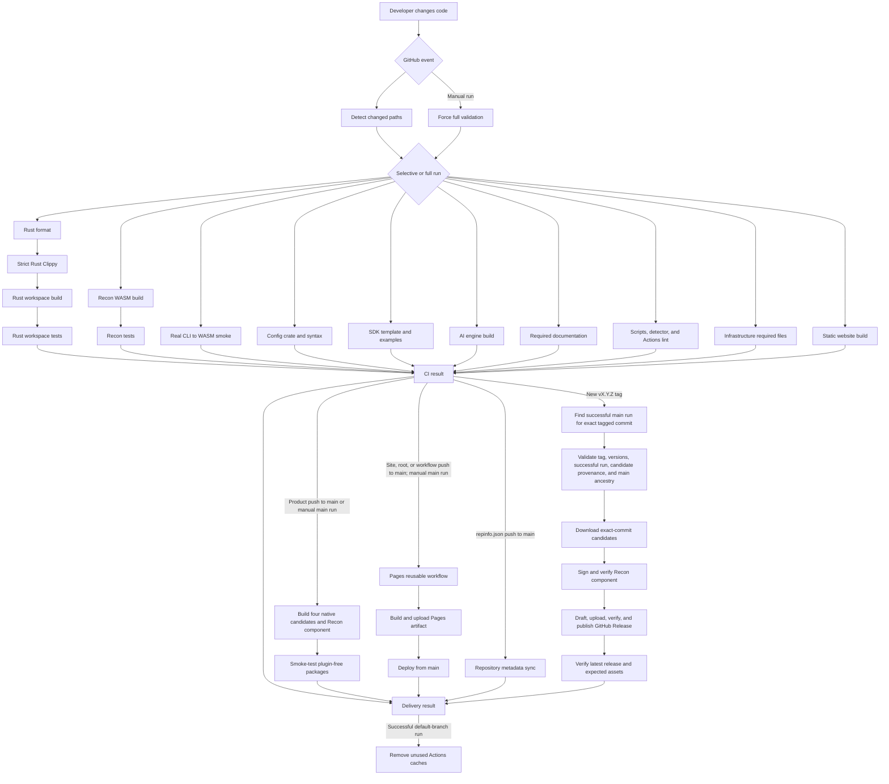

# CI And Delivery Lifecycle

PolyGlid uses `.github/workflows/ci.yml` as the single entry point for pull
requests, changes on `main`, manual full checks, release-candidate builds, and
formal version releases. An ordinary commit can create temporary candidates,
but it cannot create a GitHub Release.

## Complete Flow


```mermaid
flowchart TD
    Change[Developer changes code] --> Event{GitHub event}
    Event --> Detect[Detect changed paths]
    Detect --> Scope{Selective or full run}
    Event -->|Manual run| Full[Force full validation]
    Full --> Scope

    Scope --> Format[Rust format]
    Format --> Clippy[Strict Rust Clippy]
    Clippy --> Build[Rust workspace build]
    Build --> Tests[Rust workspace tests]

    Scope --> WasmBuild[Recon WASM build]
    WasmBuild --> WasmTests[Recon tests]
    Scope --> Smoke[Real CLI to WASM smoke]
    Scope --> Config[Config crate and syntax]
    Scope --> SDK[SDK template and examples]
    Scope --> AI[AI engine build]
    Scope --> Docs[Required documentation]
    Scope --> Ops[Scripts, detector, and Actions lint]
    Scope --> Infra[Infrastructure required files]
    Scope --> Site[Static website build]

    Tests --> Result[CI result]
    WasmTests --> Result
    Smoke --> Result
    Config --> Result
    SDK --> Result
    AI --> Result
    Docs --> Result
    Ops --> Result
    Infra --> Result
    Site --> Result

    Result --> Delivery[Delivery result]
    Result -->|Product push to main or manual main run| Candidates[Build four native candidates and Recon component]
    Result -->|Site, root, or workflow push to main; manual main run| Pages[Pages reusable workflow]
    Result -->|repinfo.json push to main| Metadata[Repository metadata sync]
    Result -->|New vX.Y.Z tag| Resolve[Find successful main run for exact tagged commit]

    Pages --> PagesBuild[Build and upload Pages artifact]
    PagesBuild --> PagesDeploy[Deploy from main]
    Candidates --> CandidateSmoke[Smoke-test plugin-free packages]
    CandidateSmoke --> Delivery
    Resolve --> Preflight[Validate tag, versions, successful run, candidate provenance, and main ancestry]
    Preflight --> Promote[Download exact-commit candidates]
    Promote --> Sign[Sign and verify Recon component]
    Sign --> Publish[Draft, upload, verify, and publish GitHub Release]
    Publish --> VerifyLatest[Verify latest release and expected assets]

    PagesDeploy --> Delivery
    Metadata --> Delivery
    VerifyLatest --> Delivery
    Delivery -->|Successful default-branch run| Cache[Remove unused Actions caches]
```

The top-level Actions overview renders jobs and their dependencies. Reusable
workflow calls such as Pages, metadata sync, and release appear as caller nodes;
open one to see its nested jobs and steps. Some boxes above expand a job's
important internal steps, so the documentation is more detailed than the
top-level GitHub graph.

The Actions overview intentionally groups related work. Formatting, Clippy,
workspace build, nextest, and doctests run as named steps on one Rust runner;
WASM build and tests share one WASM runner. Candidate resolution, preflight,
signing, publication, and download verification also share one formal-release
runner. This removes repeated runner startup, checkout, dependency installation,
cache restoration, and intermediate artifact handoffs without removing checks.

## Why A Job Runs

| Changed path or event | Job or chain | What it proves | What happens next |
| --- | --- | --- | --- |
| `apps/**`, `crates/**`, `Cargo.toml`, or `Cargo.lock` | One Rust job: format → Clippy → build → nextest → doctests | Rust is formatted, warning-free under Clippy, compilable, and tested | Feeds `CI result` |
| `plugins/**`, `contracts/**`, or WIT files | Rust chain and WASM build → tests | Host code and Recon guest compile; plugin tests pass | Feeds `CI result` |
| Product code, WASM, scripts, or root build files | MVP smoke | The real CLI componentizes and runs Recon against `localhost`, then writes the exact expected report | Feeds `CI result` |
| `crates/config/**` or `configs/**` | Config | Rust config tests and JavaScript config syntax pass | Feeds `CI result` |
| `sdk/**` | SDK | Template, Hello World, and Recon examples compile for `wasm32-wasip1` from the locked SDK workspace | Feeds `CI result` |
| `tools/ai/**` | AI | The separately locked AI engine builds in release mode | Feeds `CI result` |
| `docs/**` or root documentation | Docs | Required project and delivery documents exist and are non-empty | Feeds `CI result` |
| `.github/**`, `scripts/**`, `tools/automation/**`, `Makefile`, or `package.json` | Operations | Canonical command routing, Node and shell syntax, Cargo-workspace inventory, dependency-graph generation, detector regressions, and all Actions YAML pass | Workflow-definition changes force a full run and can verify Pages deployment from `main` |
| `infrastructure/**` | Infrastructure | The current required WPM SQL file exists and is non-empty | Feeds `CI result` |
| `site/**` or root Cargo version | Website build | The static site generator succeeds | May deploy Pages after `CI result` |
| `repinfo.json` | Metadata | The requested repository metadata is applied with the configured token | Runs only on `main` after `CI result` |
| Successful push or manual run on the default branch | Cache maintenance | Closed-PR caches and less-recently-accessed duplicate versions of each matching default-branch Rust cache family are deleted | Runs after `Delivery result` as a non-blocking maintenance stage |
| Unknown or newly added path | Every validation branch | New project areas cannot receive an empty green run | `CI result` requires every branch to execute |
| Manual run | Every validation branch | The complete repository gate passes, not only changed areas | Release candidates for a manual run on `main` |
| New version tag | Exact-commit promotion gate | The tagged commit already has a successful `main` run and unexpired candidate artifacts | Sign, checksum, and publish without recompiling |

Selective pull-request and `main` runs intentionally show unrelated jobs in
gray. Gray means the job's path condition was false, or an upstream dependency
failed. On a manual run, `CI result` rejects any skipped validation branch.
A version tag deliberately skips repeated compilation and instead requires a
successful exact-commit `main` run. A green `Delivery result` means every
validation and delivery branch that applied to that event completed successfully. Cache
maintenance runs afterward and is intentionally not a delivery gate.

Delivery jobs evaluate their event/path rules after `CI result` even when an
unrelated validation branch is gray. Their explicit `CI result == success`
guard still blocks candidate packaging, Pages, metadata writes, and releases when
an applicable validation job fails. Cache maintenance has its own guard and
runs only after `Delivery result` succeeds.

Timing benchmarks are intentionally excluded from the ordinary Rust correctness
suite because shared CI runner load is not stable enough for hard latency
thresholds. Run the real-workload benchmark explicitly on controlled hardware:

```bash
cargo test --locked -p polyglid-core \
  benchmarks::benches::run_real_workload_benchmarks -- \
  --ignored --exact --nocapture
```

## Event Outcomes

| Event | Validation scope | Delivery outcome |
| --- | --- | --- |
| Pull request to `main` | Changed areas; unknown/workflow changes force all | Validation only; no artifact, metadata write, deployment, or release |
| Push to `main` | Changed areas; unknown/workflow changes force all | Applicable four-platform release candidates, Pages, or metadata work, followed by cache maintenance |
| Manual **Run workflow** on `main` | Every validation branch | Four-platform release candidates, Pages deployment, and cache maintenance; never a formal release |
| Manual **Run workflow** on another branch | Every validation branch | Validation only; no candidates, Pages deployment, cache deletion, or formal release |
| Newly created tag such as `v0.10.1` | Exact-commit candidate promotion | Signed Recon component, checksums, GitHub Release, and latest-link verification without recompiling |
| Deleted or force-moved version tag | No release publication | The release condition rejects it |

## Cache Maintenance

Rust jobs use `Swatinem/rust-cache`, with separate cache identities where the
job or target differs. Website validation and Pages deliberately share a
`site` identity that caches the root workspace `target/` directory.

After a successful delivery on the default branch, the
`Cache · Remove unused entries` job:

1. selects cache refs shaped like `refs/pull/<number>/merge`;
2. asks GitHub for each pull request's current state;
3. keeps every cache whose pull request is still open; and
4. deletes each cache whose pull request is confirmed closed or merged;
5. groups default-branch keys matching
   `v0-rust-…-<8 hex>-<8 hex>` by job/shared-key family;
6. keeps the most recently accessed version in each family; and
7. deletes only less-recently-accessed versions superseded by that retained
   cache.

The job requests job-scoped `actions: write` permission, but its implemented
commands only list and delete cache entries; it does not call an artifact or
release deletion API. Removing a cache only means a later build may need to
compile dependencies again.

The most recently accessed matching cache in every default-branch Rust family,
open pull requests, version tags, and ordinary branch refs are never cleanup
targets. Default-branch non-Rust caches are excluded from family
deduplication; a cache of any kind can still be deleted when it belongs to a
confirmed closed pull request. Superseded matching default-branch Rust entries
are considered disposable only after a more-recently-accessed family entry
exists and delivery has passed. GitHub separately applies the cache retention
and least-recently-used eviction settings configured for the repository.

The maintenance job is non-blocking so a cache API outage cannot turn a valid
build or deployment red. Its Actions node and logs expose failures, while
successful runs write separate deletion counts and reclaimed size to the job
summary. Pull-request runs do not receive cache-deletion permission and show
the job as skipped.

## Release Candidates

A successful product/full-validation push to `main`, or a manual run on
`main`, creates these Actions artifacts:

```text
release-candidate-linux-x86_64
release-candidate-windows-x86_64
release-candidate-macos-x86_64
release-candidate-macos-aarch64
release-candidate-recon-probe
```

The native archives contain each platform's CLI, desktop executable, README,
and both license files. They deliberately have no `plugins/` directory. The
Recon candidate contains an unsigned component, manifest, and provenance
record binding the version, commit SHA, and embedded public key. Candidates
expire after 14 days and are not GitHub Releases.

## Formal Version Releases

The root workspace version and `plugins/recon-probe/polyglid.toml` must contain
the same release version. After the version change is reviewed and merged:

```bash
git switch main
git pull --ff-only
cargo test --locked --workspace --exclude polyglid-site
git tag v0.10.1
git push origin v0.10.1
```

Do not tag an unpushed local commit. Release preflight checks:

1. The tag has the exact `vMAJOR.MINOR.PATCH` form.
2. The root Cargo version matches the tag.
3. The Recon manifest version matches the tag.
4. The checked-out tag resolves to the commit being validated.
5. The tagged commit is contained in `origin/main`.
6. A successful `main` push run exists for the exact tag commit.
7. That run still contains every unexpired release candidate.
8. Candidate provenance matches the tag version, commit, and signing public key.

Wait for the tagged commit's `main` run to be green before pushing its tag. A
tag pushed earlier fails quickly instead of waiting for or rebuilding missing
candidates.

The release requires the `RECON_SIGNING_PRIVATE_SEED` Actions secret and the
matching `RECON_SIGNING_PUBLIC_KEY` repository variable. It signs and verifies
the promoted Recon component and publishes its component, detached signature,
and manifest as separate release assets. Native application archives were
already built and smoke-tested by the successful `main` run. The tag path only
downloads, verifies, signs, checksums, and publishes them, targeting a 3–4
minute promotion instead of repeating every compilation job.

## Local Pre-Commit Feedback

Enable the repository-owned hook once per clone:

```bash
scripts/ops/install-git-hooks.sh
```

The hook runs formatting, locked metadata/version consistency, operations
tests, detector tests, and Actions lint before a commit is created. Use
`SKIP_POLYGLID_PRECOMMIT=1 git commit ...` only for an explicit emergency; the
hook is developer feedback, not a release trust boundary. Pull requests and
`main` still run authoritative CI, and only successful `main` artifacts can be
promoted by a version tag.

The release remains a draft while assets upload. The job verifies all expected
asset names before publishing, and a rerun can safely complete an existing
draft. The final release verification confirms that `releases/latest` points
to this tag and that the published release contains the expected asset names.

## Website And Metadata

A site/root/workflow change on `main`, or a manual full run from `main`, calls
`deploy-site.yml` only after `CI result`. Including workflow changes makes a
failed or updated deployment pipeline recoverable without an unrelated website
edit. The nested workflow resolves the latest published GitHub Release,
generates the site, uploads the Pages artifact, and deploys it from `main`. If
no public release exists, download buttons remain hidden. Browser-side release
discovery updates the displayed version and reveals stable
`releases/latest/download` links as soon as the first release is published, so
a tag workflow does not need a tag-context Pages deployment.

A `repinfo.json` change on `main` calls `repo-sync.yml` after `CI result`.
It requires `GH_PAT`; a missing token fails `Delivery result`. Prefer a
fine-grained token or GitHub App limited to this repository and only the
metadata permissions actually required.

## Making The Flow Enforced

Workflow YAML makes checks visible, but it cannot protect a branch by itself.
After the first run creates the check name, configure a GitHub ruleset for
`main` that:

- requires a pull request and the `Delivery result` status check;
- blocks force pushes and branch deletion;
- limits who can bypass the rule.

Add a tag ruleset for `v*.*.*` that restricts creation and blocks updates and
deletion. Until those repository rules are configured, the graph runs but a
user with direct push access can bypass it.

## Current Release Boundary

The runtime tests now cover denied host imports and exact scoped grants, and
formal releases enforce a cryptographically verified detached signature for the
separately downloadable component. Package jobs execute the unpacked CLI,
require an empty default plugin installation, and reject unresolved Linux
desktop libraries. Release publication independently requires the signed
component, signature, and exact-scope manifest.

Release builds compile the configured official public key into the desktop
client. First startup enrolls only that pinned publisher and refuses a database
record with the same official identity but a different key, so Balanced policy
can verify the separately downloaded official component without a
Development-policy fallback.

There is still no Windows/macOS platform code signing, installer, macOS
notarization, SBOM/provenance attestation, or automated headless desktop journey
on a pristine VM. The Rust `stable` toolchain and major-version Action
references remain mutable, so builds are not bit-for-bit reproducible.
