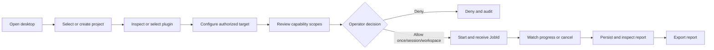

# UI-First MVP

The first product MVP is a trustworthy desktop journey, not a terminal demo.
The Dioxus desktop application is the primary client. The existing CLI remains
a frozen development and regression harness and is not a product acceptance
surface for this milestone.

The client boundary and migration rules are defined in the canonical
[Client Architecture](../architecture/CLIENT_ARCHITECTURE.md). The current
surface inventory is in [Desktop UI](../architecture/DESKTOP_UI.md).

## MVP Outcome

An operator can install PolyGlid Desktop, select or create a local project,
inspect a WASM plugin, explicitly decide its requested capabilities, run it
against an authorized target, observe or cancel the job, and reopen and export
the persisted report.

## Included

### Desktop product shell

- Dioxus desktop application for supported Linux, Windows, and macOS targets;
- Projects, New scan, Executions, Reports, Plugins, and Settings navigation;
- clear loading, empty, ready, denied, running, cancelling, cancelled, failed,
  and completed states;
- keyboard and focus support for the primary journey;
- excluded or incomplete product areas absent from compiled navigation.

### Local workspace

- persistent workspace and project catalog;
- safe project creation, rename, archive/remove, and confirmed filesystem
  deletion;
- project-scoped, validated targets rather than seeded production values.

### Plugin lifecycle

- local WASM component selection and validation;
- manifest, version, publisher identity, checksum, and requested capability
  review;
- install, enable, disable, and uninstall operations;
- one harmless first-party `recon-probe` component.

### Permission and execution lifecycle

- installation and execution approval are separate decisions;
- deny, allow-once, session, and workspace approval scopes;
- exact resource scope and plain-language rationale for every capability;
- denied-by-default enforcement in core immediately before runtime linking;
- asynchronous job submission that returns a `JobId`;
- typed queued, started, progress, cancelling, cancelled, failed, and completed
  events;
- timeout, fuel limit, safe failure handling, and confirmed cancellation;
- audit records for permission and execution decisions.

### Reports

- real structured summary and findings from the plugin contract;
- persisted report history linked to project, plugin, target, and job;
- report detail with no fabricated scores, timings, or charts;
- JSON export required for MVP;
- HTML, Markdown, and SARIF export may follow in the same report service.

### Distribution

- release archives or installers for supported desktop targets;
- declared Linux runtime dependencies or a suitably self-contained package;
- checksums and clear supported-platform instructions;
- clean-machine installation and primary-journey smoke tests.

## Excluded

- new end-user CLI workflows;
- marketplace purchasing, ratings, or remote publishing;
- aggressive scanning or privileged exploit modules;
- production Work Tracks, Automation, AI Agents, or an interactive terminal;
- multi-window and detached-editor workflows;
- web and mobile clients;
- remote execution before authenticated server protocol work;
- automatic permission approval based on installation or plugin enable state.

Excluded features remain outside the compiled desktop product. Any future design
prototype must be isolated from production source/routing and cannot appear as a
working function.

## Security Conditions

The MVP cannot ship while any of these conditions is false:

- Enabling a plugin does not grant its requested capabilities.
- Installation confirmation does not grant execution capabilities.
- Every host capability has an explicit, unexpired decision with a matching
  plugin identity and resource scope.
- Core policy revalidates the decision; the UI is not the enforcement boundary.
- A plugin cannot access filesystem, network, process, environment, or report
  services unless the host links the approved capability.
- Permission decisions, execution transitions, and runtime failures are
  auditable without recording secrets.
- Official and third-party components pass the configured signature policy;
  bundled status never bypasses trust verification.
- A runtime failure cannot crash the desktop host or corrupt the project
  catalog.

## Completion Checklist

### Primary journey

- [ ] A new user can launch the packaged desktop app on every supported target.
- [ ] The user can create or select a real project without opening a terminal.
- [ ] The user can inspect and install `recon-probe` from the UI.
- [ ] The packaged Recon component and adjacent signature verify under default
      Balanced policy without a Development-policy fallback.
- [ ] The UI explains every requested capability and its exact scope.
- [ ] Denying a capability prevents execution and creates an audit record.
- [ ] Allowing a valid scope starts a job and returns a visible job ID.
- [ ] Run progress and state changes appear without blocking the UI.
- [ ] The user can request cancellation and see the confirmed final state.
- [ ] A completed run creates a persisted report with real values only.
- [ ] The user can close the app, reopen it, find the report, and export JSON.

### Product clarity

- [ ] Navigation contains Projects, New scan, Executions, Reports, Plugins, and Settings.
- [ ] Excluded preview/reserved areas are absent from the compiled desktop UI.
- [ ] Loading, empty, error, denied, running, and completed states are tested.
- [ ] Destructive project and plugin actions state their exact effect.
- [ ] Icon-only controls have accessible names and visible keyboard focus.
- [ ] No fake health score, timing, automation status, or agent activity appears
      as live data.

### Engineering evidence

- [ ] Client views depend on feature controllers and stores, not
      `DesktopBackend`, SQLite, or Wasmtime.
- [ ] `ClientGateway` has focused contract and local-adapter tests.
- [ ] Permission enforcement has allow, deny, expiration, and scope tests.
- [ ] Execution has progress, timeout, cancellation-race, and failure tests.
- [ ] Report persistence and export round-trip tests pass.
- [ ] Core, runtime, plugin, and desktop test suites pass in CI.
- [ ] Clean-machine desktop smoke tests pass for supported release artifacts.

The MVP is complete only when the desktop journey satisfies this checklist.
Passing the CLI harness alone does not complete the product MVP.
