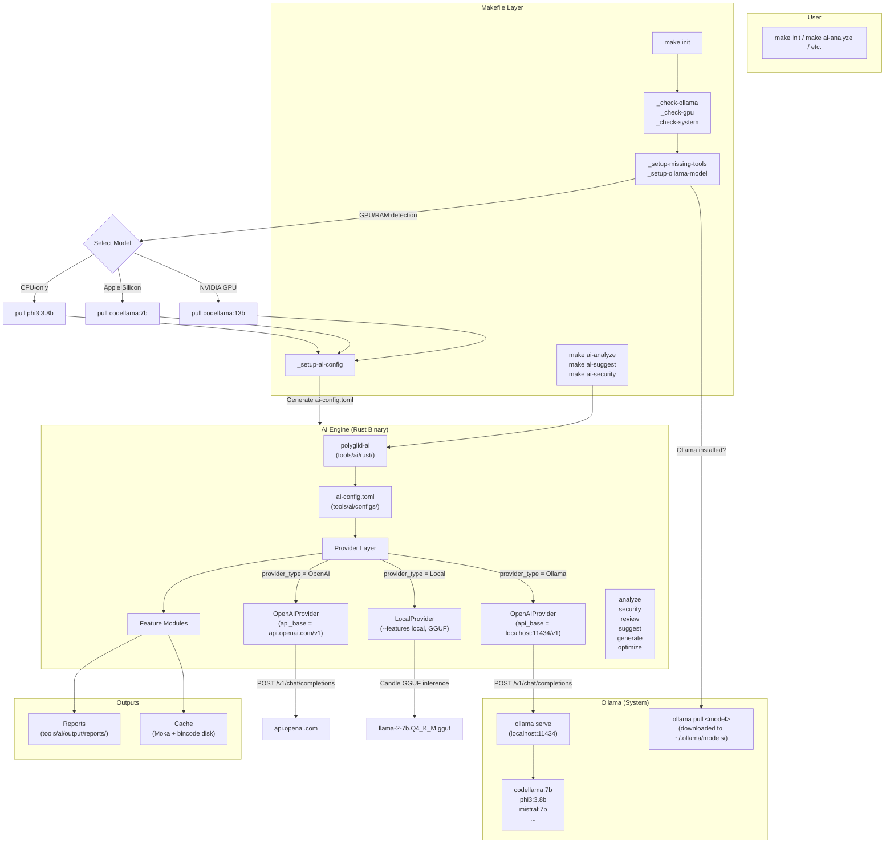

# PolyGlid AI Architecture



---

## 1. What Happens on `make init`

```
make init
  ├── Phase 1/6 — Check dev tools (rustc, cargo, node, etc.)
  ├── Phase 2/6 — Check Git config (user.name, user.email)
  ├── Phase 3/6 — Check Docker (binary, daemon, compose)
  ├── Phase 4/6 — Check Ollama (binary, version, daemon, pulled models)
  ├── Phase 5/6 — Check System (CPU cores, RAM, free disk)
  ├── Phase 6/6 — Detect GPU (NVIDIA nvidia-smi, Apple Silicon, or CPU-only)
  │
  ├── 🔧 Auto-Setup — Install Missing Tools
  │     ├── rustc missing? → curl https://sh.rustup.rs | sh
  │     ├── pnpm missing?   → npm install -g pnpm
  │     └── ollama missing? → curl https://ollama.com/install.sh | sh
  │
  ├── 🤖 Auto-Setup — Pull Recommended Ollama Model
  │     ├── NVIDIA GPU detected?  → ollama pull codellama:13b
  │     ├── Apple Silicon?         → ollama pull codellama:7b
  │     └── CPU-only (no GPU)?    → ollama pull phi3:3.8b
  │
  ├── 🔧 Auto-Setup — Generate ai-config.toml
  │     └── Writes tools/ai/configs/ai-config.toml
  │         with the correct provider_type, api_base, model
  │
  ├── Phase 2/4 — Install project dependencies (npm/pnpm/cargo)
  ├── Phase 3/4 — Build workspace + AI engine
  └── Phase 4/4 — Validate workspace structure
```

---

## 2. How the AI Engine Connects to Ollama

```
polyglid-ai analyze
       │
       ▼
  AIEngine::new()
       │
       ├── Load ai-config.toml
       │     provider_type = "Ollama"
       │     api_base      = "http://localhost:11434/v1"
       │     model         = "codellama:7b"
       │
       ├── ProviderFactory::create()
       │     └── OpenAIProvider::new("http://localhost:11434/v1", None)
       │           │
       │           └── POST http://localhost:11434/v1/chat/completions
       │                 Body: { model: "codellama:7b", messages: [...], ... }
       │                 No auth header (Ollama doesn't need API keys)
       │
       └── Run command (analyze, suggest, security, ...)
```

**Key insight:** Ollama serves an OpenAI-compatible API. The same `OpenAIProvider` class works for both — just change the `api_base`:

| Provider | `api_base` | `api_key` |
|----------|-----------|-----------|
| Ollama (local) | `http://localhost:11434/v1` | (empty) |
| OpenAI (cloud) | `https://api.openai.com/v1` | `sk-...` |
| Any OpenAI-compat | any URL | varies |

---

## 3. Configuration Files

### Primary: `tools/ai/configs/ai-config.toml`

```toml
provider_type = "Ollama"             # Ollama | OpenAI | Local | Anthropic | Hybrid
api_base      = "http://localhost:11434/v1"  # API endpoint
api_key       = ""                   # Leave empty for Ollama
model         = "codellama:7b"       # Default model
temperature   = 0.7
max_tokens    = 4096

[models]
code     = "codellama:7b"   # Code generation + review
security = "codellama:7b"   # Security scanning
build    = "codellama:7b"   # Build optimization
suggest  = "codellama:7b"   # Workspace suggestions
```

### Per-domain model configs: `tools/ai/configs/model-configs/*.toml`

These are **reference files** for when the engine supports per-file config loading.
Currently, per-domain models are defined inline in `ai-config.toml` `[models]`.

---

## 4. Switching Providers

### To use OpenAI (cloud GPT-4):

Edit `ai-config.toml`:
```toml
provider_type = "OpenAI"
api_base      = "https://api.openai.com/v1"
api_key       = "sk-your-key-here"
model         = "gpt-4"
```

Or set `OPENAI_API_KEY` environment variable.

### To use a different Ollama model:

```bash
ollama pull mistral:7b       # Pull the model
```

Then edit `ai-config.toml`:
```toml
model = "mistral:7b"
```

### To use local GGUF inference (experimental):

```bash
cargo build --release --features local
# Place a GGUF model at tools/ai/models/gguf/llama-2-7b.Q4_K_M.gguf
```

Edit `ai-config.toml`:
```toml
provider_type = "Local"
```

---

## 5. Adding a New Provider

1. Create `src/providers/<name>.rs` implementing the `Provider` trait
2. Add the variant to `ProviderType` enum in `engine.rs`
3. Add the creation logic to `ProviderFactory::create()` in `providers/mod.rs`
4. Update `ai-config.toml` to support any new config fields

The `Provider` trait requires 4 methods:
```rust
#[async_trait]
pub trait Provider {
    async fn generate(&self, prompt: &str) -> Result<String>;
    async fn analyze_code(&self, code: &str, language: &str) -> Result<CodeAnalysis>;
    async fn generate_tests(&self, code: &str, language: &str) -> Result<String>;
    async fn generate_documentation(&self, code: &str, language: &str) -> Result<String>;
}
```

---

## 6. Directory Structure

```
tools/ai/
├── ARCHITECTURE_AI.md              ← This file
├── configs/
│   ├── ai-config.toml              ← Active configuration
│   └── model-configs/
│       ├── README.md
│       ├── build-model.toml        ← Reference (unused)
│       ├── code-model.toml         ← Reference (unused)
│       └── security-model.toml     ← Reference (unused)
├── output/
│   └── reports/                    ← Analysis reports (JSON)
├── rust/
│   ├── Cargo.toml                  ← Independent workspace
│   ├── build.rs
│   ├── src/
│   │   ├── main.rs                 ← CLI (7 commands)
│   │   ├── core/
│   │   │   ├── engine.rs           ← AIEngine, EngineConfig, ProviderType
│   │   │   ├── context.rs          ← Workspace context
│   │   │   └── models.rs           ← Data types
│   │   ├── providers/
│   │   │   ├── mod.rs              ← ProviderFactory
│   │   │   ├── traits.rs           ← Provider trait
│   │   │   ├── openai.rs           ← OpenAI-compatible (works with Ollama)
│   │   │   └── local.rs            ← Local GGUF inference
│   │   ├── features/
│   │   │   ├── code_analysis.rs    ← Stub
│   │   │   ├── dependency_advisor.rs ← Stub
│   │   │   ├── build_optimizer.rs  ← Stub
│   │   │   ├── test_generator.rs   ← Stub
│   │   │   └── security_analyzer.rs ← Stub
│   │   ├── cache/
│   │   │   └── mod.rs              ← Moka + bincode cache
│   │   └── cli/
│   │       └── commands.rs         ← CLI implementations
│   └── target/                     ← Compiled binary (gitignored)
└── models/                         ← For future local GGUF models
    └── gguf/
```

---

## 7. Command-to-Provider Mapping

| `polyglid-ai` command | Provider method | Calls Ollama? |
|----------------------|----------------|---------------|
| `analyze` | `provider.generate()` + stubs | ✅ Yes |
| `generate code` | `provider.generate()` | ✅ Yes |
| `generate tests` | `provider.generate_tests()` | ✅ Yes |
| `generate docs` | `provider.generate_documentation()` | ✅ Yes |
| `review` | `provider.analyze_code()` | ✅ Yes |
| `suggest` | Rule-based (no provider call) | ❌ No |
| `optimize` | Stub (no provider call) | ❌ No |
| `security` | `provider.generate()` + stub | ✅ Yes |
| `status` | Reads config only | ❌ No |

---

## 8. Future Extensions

### What's ready now:
- ✅ Ollama auto-install + model pull in `make init`
- ✅ Configurable `api_base` for any OpenAI-compatible API
- ✅ Per-domain model overrides via `[models]` in config
- ✅ Provider switching via `provider_type` + `api_base`

### What needs work:
- ❌ Feature modules (analyze, security, optimize) are stubs — return placeholder data
- ❌ No structured output parsing from LLM responses (scores are hardcoded)
- ❌ `code-model.toml` / `security-model.toml` / `build-model.toml` are defined but never loaded
- ❌ No test suite for the AI engine
- ❌ `polyglid-ai` binary not built in release profile by default
